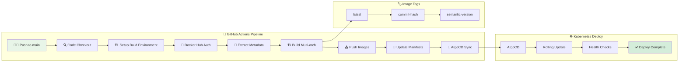
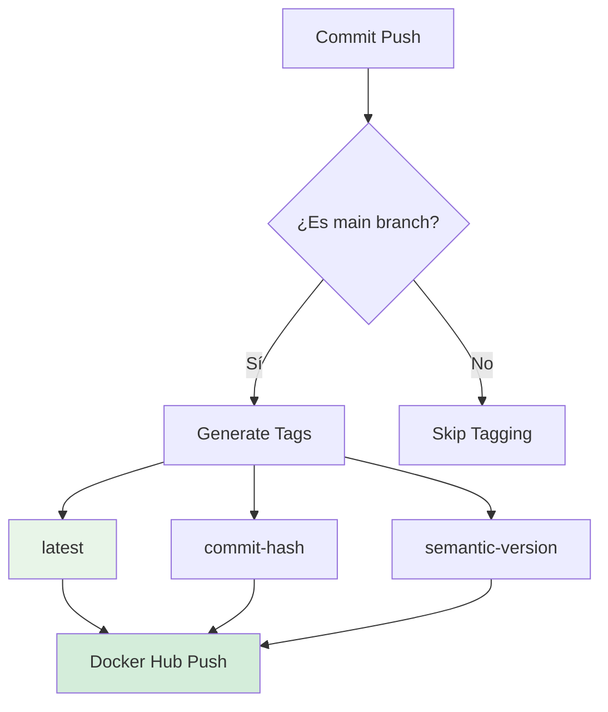
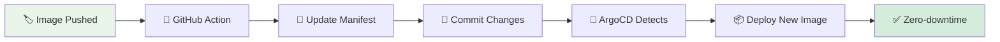
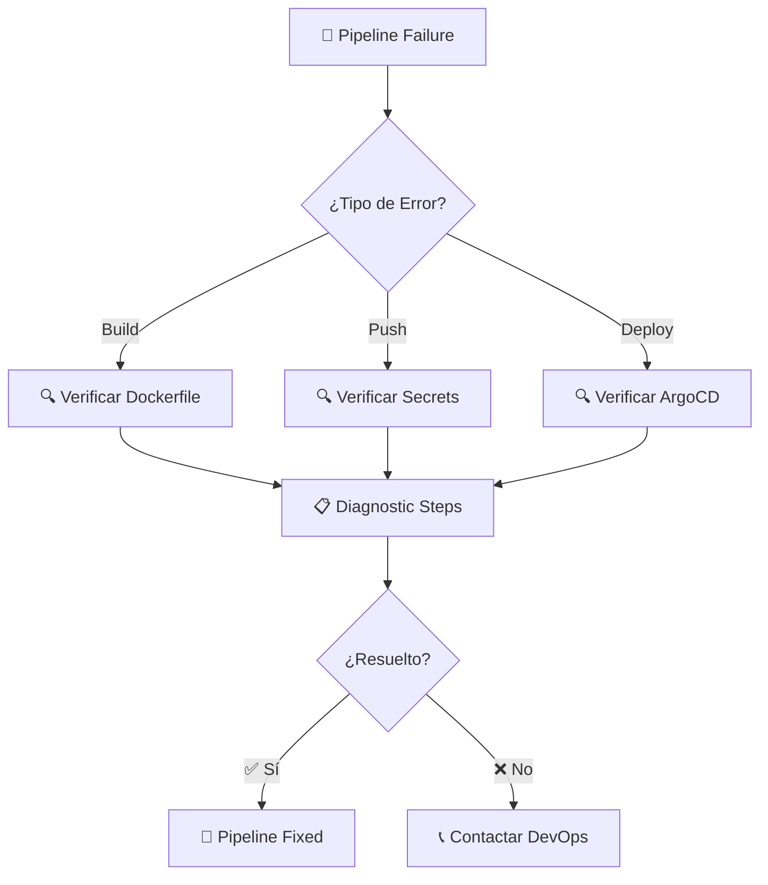

# 🚀 CI/CD Pipeline - GitHub Actions

[](https://github.com/features/actions)
[](https://docker.com/)
[](https://argo-cd.readthedocs.io/)

> **Pipeline completo de CI/CD** automatizado con GitHub Actions, Docker y GitOps para despliegue continuo de Backstage IDP.

## 📋 Descripción General

Esta carpeta contiene la **configuración completa de CI/CD** usando GitHub Actions para automatizar el proceso de construcción, testing, publicación y despliegue de la aplicación Backstage.

### ✨ Características Principales

- 🔄 **GitOps First**: Integración nativa con ArgoCD
- 🐳 **Multi-plataforma**: Builds para amd64 y arm64
- 🏷️ **Versionado Automático**: Tags semánticos y por commit
- 🔒 **Seguridad**: Secrets encriptados y acceso controlado
- 📊 **Monitoreo**: Métricas y logs detallados del pipeline

## 🏗️ Arquitectura del Pipeline



## 📂 Estructura del Pipeline

```
📁 .github/
├── 🔄 workflows/
│   └── 🐳 docker-image.yml     # 🚀 Pipeline principal CI/CD
├── 📋 README.md                # 📖 Esta documentación
└── 🔧 dependabot.yml           # 🤖 Actualizaciones automáticas (opcional)
```

## 🚀 Workflow: Build and Push Docker Image

### 🎯 Descripción y Propósito

El workflow `docker-image.yml` es el **corazón del pipeline CI/CD**, responsable de:

- ✅ **Construir** imágenes Docker multi-plataforma
- 🏷️ **Versionar** automáticamente las imágenes
- 📤 **Publicar** en Docker Hub
- 🔄 **Actualizar** manifests de Kubernetes
- 🚀 **Desplegar** vía ArgoCD

### ⚡ Triggers y Eventos

| Trigger | Descripción | Frecuencia |
|---------|-------------|------------|
| `push: main` | Push a rama principal | Automático |
| `workflow_dispatch` | Ejecución manual | On-demand |
| `pull_request` | PR a main (opcional) | Validación |

### 🏃‍♂️ Jobs y Pasos Detallados

#### 📋 Job: `build-and-push`

**Runner**: `ubuntu-latest` (GitHub-hosted)

##### Paso 1: 🔍 Checkout Code
```yaml
- name: Checkout code
  uses: actions/checkout@v4
  with:
    fetch-depth: 0  # Para acceder a historial completo
```

##### Paso 2: 🏗️ Setup QEMU
```yaml
- name: Set up QEMU
  uses: docker/setup-qemu-action@v3
```
**Propósito**: Emulación para arquitecturas múltiples (arm64)

##### Paso 3: 🐳 Setup Docker Buildx
```yaml
- name: Set up Docker Buildx
  uses: docker/setup-buildx-action@v3
```
**Propósito**: Builder avanzado para multi-plataforma

##### Paso 4: 🔐 Login to DockerHub
```yaml
- name: Log in to DockerHub
  uses: docker/login-action@v3
  with:
    username: ${{ secrets.DOCKERHUB_USERNAME }}
    password: ${{ secrets.DOCKERHUB_TOKEN }}
```

##### Paso 5: 📝 Extract Commit Metadata
```yaml
- name: Extract commit hash
  id: vars
  run: |
    echo "commit_hash=$(git rev-parse --short HEAD)" >> $GITHUB_OUTPUT
    echo "commit_message=$(git log -1 --pretty=%B)" >> $GITHUB_OUTPUT
```

##### Paso 6: 🏗️ Build and Push Multi-arch
```yaml
- name: Build and push Docker image
  uses: docker/build-push-action@v5
  with:
    context: ./IDP
    file: ./IDP/Dockerfile
    push: true
    platforms: linux/amd64,linux/arm64
    tags: |
      jaimehenao8126/backstage-custom:latest
      jaimehenao8126/backstage-custom:${{ steps.vars.outputs.commit_hash }}
    cache-from: type=gha
    cache-to: type=gha,mode=max
```

## 🔐 Configuración de Secrets

### 📋 Secrets Requeridos

| Secret | Descripción | Cómo Obtener |
|--------|-------------|--------------|
| `DOCKERHUB_USERNAME` | Usuario Docker Hub | Tu username |
| `DOCKERHUB_TOKEN` | Token de acceso | Docker Hub → Account Settings → Security |

### 🛠️ Configuración en GitHub

```bash
# Navegar a la configuración del repo
# https://github.com/Portfolio-jaime/Backstage-Manual/settings/secrets/actions

# Agregar secrets:
# DOCKERHUB_USERNAME = jaimehenao8126
# DOCKERHUB_TOKEN = tu_token_personal
```

## 🏷️ Estrategia de Versionado

### 📊 Tags Generados



#### Ejemplos de Tags

```
# Tags automáticos generados:
jaimehenao8126/backstage-custom:latest
jaimehenao8126/backstage-custom:a1b2c3d
jaimehenao8126/backstage-custom:v1.2.3 (futuro)
```

## 🔄 Integración GitOps

### 📝 Actualización Automática de Manifests



#### Archivo Actualizado Automáticamente

```yaml
# Manifest/backstage/deploy-backstage.yaml
spec:
  template:
    spec:
      containers:
      - name: backstage
        image: jaimehenao8126/backstage-custom:a1b2c3d  # ← Actualizado automáticamente
```

## 📊 Monitoreo y Observabilidad

### 📈 Métricas del Pipeline

- **⏱️ Duración**: Tiempo total de ejecución
- **✅ Tasa de Éxito**: Builds exitosos vs fallidos
- **📦 Tamaño de Imágenes**: Optimización de layers
- **🔄 Frecuencia**: Builds por día/semana

### 📊 Dashboard de CI/CD

```yaml
# Ejemplo de métricas expuestas
ci_cd_metrics:
  build_duration_seconds: 420
  build_success_rate: 0.95
  image_size_bytes: 450000000
  deployments_per_week: 14
```

## 🆘 Troubleshooting Avanzado

### 🔍 Diagnóstico Sistemático



### 🛠️ Comandos de Debug

```bash
# Ver estado del workflow
gh run list --workflow=docker-image.yml

# Ver logs detallados
gh run view <run-id> --log

# Ver configuración de secrets
gh secret list

# Probar build local
docker build -f IDP/Dockerfile ./IDP
```

### 🔧 Soluciones Comunes

| 🚨 Problema | 🔍 Diagnóstico | ✅ Solución |
|-------------|----------------|-------------|
| `buildx failed` | QEMU no inicializado | Verificar setup-qemu-action |
| `denied: access forbidden` | Token expirado | Rotar DOCKERHUB_TOKEN |
| `no space left` | Disco lleno en runner | Limpiar cache de Docker |
| `ArgoCD out of sync` | Manifest no actualizado | Verificar permisos de repo |

## ⚡ Optimizaciones de Performance

### 🚀 Mejoras Implementadas

- **🏗️ BuildKit**: Builder paralelo para capas
- **💾 Cache**: Cache de layers entre builds
- **📦 Multi-stage**: Imágenes optimizadas
- **🔄 Concurrent**: Builds paralelos cuando aplica

### 📊 Métricas de Optimización

```yaml
# Comparación antes/después
before_optimization:
  build_time: "15m 30s"
  image_size: "850MB"

after_optimization:
  build_time: "8m 45s"
  image_size: "450MB"
```

## 🔮 Extensiones y Evolución

### 🚀 Próximas Funcionalidades

- [ ] 🧪 **Testing Pipeline**: Tests automatizados antes del build
- [ ] 🔍 **Security Scanning**: Escaneo de vulnerabilidades
- [ ] 📊 **Performance Testing**: Benchmarks automatizados
- [ ] 🚀 **Multi-environment**: Deploy a staging/production
- [ ] 📱 **Notifications**: Slack/email alerts
- [ ] 📈 **Advanced Metrics**: Cost analysis y efficiency

### 🛠️ Mejoras Técnicas

- [ ] 🔄 **Matrix Builds**: Tests en múltiples versiones
- [ ] 📦 **Artifact Caching**: Cache de dependencias
- [ ] 🤖 **Auto-merge**: PRs automáticos para dependencias
- [ ] 📊 **Cost Optimization**: Análisis de uso de minutos
- [ ] 🔒 **Security Hardening**: Secrets management avanzado

## 📞 Soporte y Referencias

### 🆘 Canales de Ayuda

- 📧 **Email**: jaimehenao8126@outlook.com
- 🐛 **Issues**: [GitHub Issues](https://github.com/Portfolio-jaime/Backstage-Manual/issues)
- 📖 **GitHub Actions Docs**: [docs.github.com/actions](https://docs.github.com/actions)
- 🐳 **Docker Buildx**: [docs.docker.com/buildx](https://docs.docker.com/buildx/)

### 📚 Documentación Relacionada

- [`../README.md`](../README.md) - Documentación principal del proyecto
- [`../Manifest/backstage/README.md`](../Manifest/backstage/README.md) - Configuración de Backstage
- [`../Scripts/README.md`](../Scripts/README.md) - Scripts de automatización

---

<div align="center">

**🚀 Desarrollado con ❤️ para CI/CD enterprise**

*¡Automatización que acelera el desarrollo!*

</div>