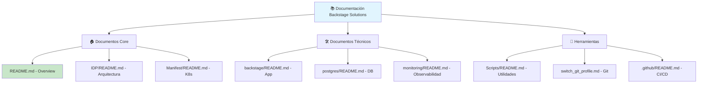
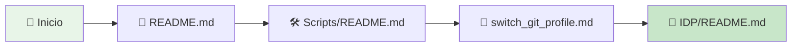
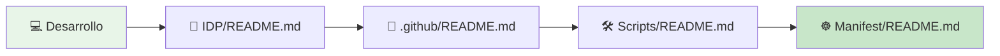
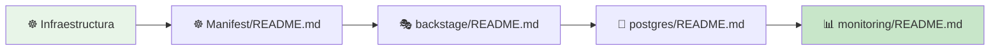
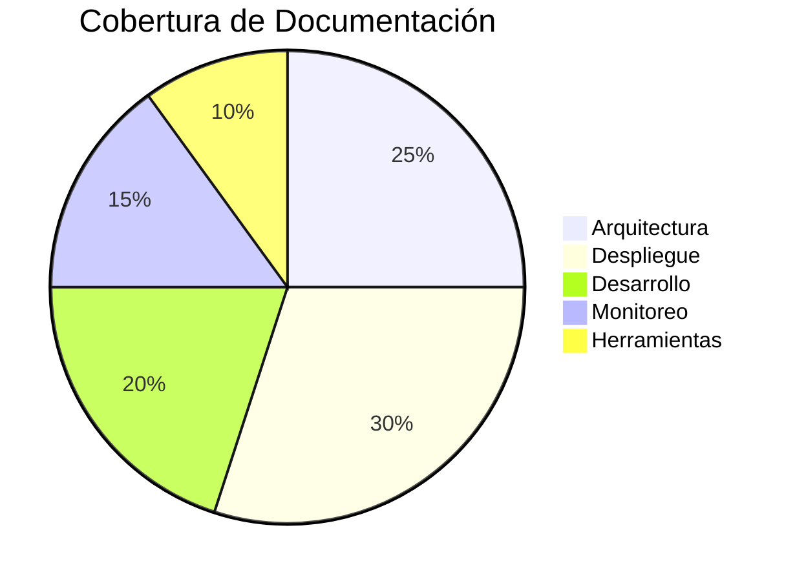

# 📚 Índice Maestro de Documentación - Backstage Solutions

> **Guía completa y navegable** de toda la documentación del proyecto Backstage Solutions. Encuentra rápidamente lo que necesitas con este índice organizado por categorías y niveles de complejidad.

## 🎯 Navegación Rápida

### 📖 **Documentos Principales**
- [**🏠 README.md**](README.md) - Visión general completa del proyecto
- [**🎨 IDP/README.md**](IDP/README.md) - Arquitectura y desarrollo de Backstage
- [**☸️ Manifest/README.md**](Manifest/README.md) - Despliegue en Kubernetes

### 🛠️ **Documentos Técnicos**
- [**🎭 Manifest/backstage/README.md**](Manifest/backstage/README.md) - Configuración Backstage
- [**🐘 Manifest/postgres/README.md**](Manifest/postgres/README.md) - Base de datos PostgreSQL
- [**📊 Manifest/monitoring/README.md**](Manifest/monitoring/README.md) - Stack de monitoreo

### 🔧 **Herramientas y Automatización**
- [**🛠️ Scripts/README.md**](Scripts/README.md) - Scripts de utilidad
- [**🔄 Scripts/README_switch_git_profile.md**](Scripts/README_switch_git_profile.md) - Gestión de perfiles Git
- [**🚀 .github/README.md**](.github/README.md) - Pipeline CI/CD

---

## 📑 Estructura de Documentación

---

## 🎨 Mapa de Conocimiento

### 🏗️ **Arquitectura y Diseño**

| Tema | Documento | Nivel | Tiempo Estimado |
|------|-----------|-------|-----------------|
| 🏛️ **Visión General** | [`README.md`](README.md) | Principiante | 10 min |
| 🏗️ **Arquitectura IDP** | [`IDP/README.md`](IDP/README.md) | Intermedio | 15 min |
| ☸️ **Despliegue K8s** | [`Manifest/README.md`](Manifest/README.md) | Avanzado | 20 min |
| 📊 **Monitoreo** | [`Manifest/monitoring/README.md`](Manifest/monitoring/README.md) | Intermedio | 12 min |

### 🚀 **Desarrollo y Despliegue**

| Tema | Documento | Nivel | Tiempo Estimado |
|------|-----------|-------|-----------------|
| 🎭 **Backstage App** | [`Manifest/backstage/README.md`](Manifest/backstage/README.md) | Avanzado | 18 min |
| 🐘 **PostgreSQL** | [`Manifest/postgres/README.md`](Manifest/postgres/README.md) | Intermedio | 15 min |
| 🚀 **CI/CD Pipeline** | [`.github/README.md`](.github/README.md) | Intermedio | 14 min |

### 🛠️ **Herramientas y Utilidades**

| Tema | Documento | Nivel | Tiempo Estimado |
|------|-----------|-------|-----------------|
| 🛠️ **Scripts** | [`Scripts/README.md`](Scripts/README.md) | Principiante | 8 min |
| 🔄 **Perfiles Git** | [`Scripts/README_switch_git_profile.md`](Scripts/README_switch_git_profile.md) | Principiante | 5 min |

---

## 📖 Guías de Lectura Recomendadas

### 🌱 **Para Principiantes**

**Secuencia sugerida:**
1. [`README.md`](README.md) - Entender el proyecto
2. [`Scripts/README.md`](Scripts/README.md) - Scripts disponibles
3. [`Scripts/README_switch_git_profile.md`](Scripts/README_switch_git_profile.md) - Gestión Git
4. [`IDP/README.md`](IDP/README.md) - Arquitectura Backstage

### 👨‍💻 **Para Desarrolladores**

**Secuencia sugerida:**
1. [`IDP/README.md`](IDP/README.md) - Desarrollo Backstage
2. [`.github/README.md`](.github/README.md) - Pipeline CI/CD
3. [`Scripts/README.md`](Scripts/README.md) - Automatización
4. [`Manifest/README.md`](Manifest/README.md) - Despliegue

### ☸️ **Para DevOps/Infraestructura**

**Secuencia sugerida:**
1. [`Manifest/README.md`](Manifest/README.md) - Overview Kubernetes
2. [`Manifest/backstage/README.md`](Manifest/backstage/README.md) - Backstage deployment
3. [`Manifest/postgres/README.md`](Manifest/postgres/README.md) - Base de datos
4. [`Manifest/monitoring/README.md`](Manifest/monitoring/README.md) - Observabilidad

---

## 🔍 Búsqueda por Categorías

### 🎯 **Por Rol/Tarea**

| Rol | Documentos Recomendados |
|-----|------------------------|
| 👨‍💻 **Desarrollador** | `IDP/README.md`, `.github/README.md`, `Scripts/README.md` |
| ☸️ **DevOps** | `Manifest/`, `.github/README.md` |
| 📊 **SRE/SysAdmin** | `Manifest/monitoring/`, `Manifest/postgres/` |
| 👥 **Team Lead** | `README.md`, `Manifest/README.md` |

### 🏷️ **Por Tecnología**

| Tecnología | Documentos |
|------------|------------|
| **Backstage** | `README.md`, `IDP/README.md`, `Manifest/backstage/` |
| **Kubernetes** | `Manifest/`, todos los subdirectorios |
| **PostgreSQL** | `Manifest/postgres/README.md` |
| **Prometheus/Grafana** | `Manifest/monitoring/README.md` |
| **GitHub Actions** | `.github/README.md` |
| **Docker** | `IDP/README.md`, `.github/README.md` |
| **Python** | `Scripts/README.md`, `Scripts/README_switch_git_profile.md` |

### 🚨 **Por Tipo de Problema**

| Problema | Documento | Sección |
|----------|-----------|---------|
| **Despliegue falla** | `Manifest/backstage/README.md` | Troubleshooting |
| **Base de datos** | `Manifest/postgres/README.md` | Troubleshooting |
| **Monitoreo** | `Manifest/monitoring/README.md` | Troubleshooting |
| **CI/CD** | `.github/README.md` | Troubleshooting |
| **Scripts** | `Scripts/README.md` | Troubleshooting |

---

## 📊 Estadísticas de Documentación

### 📈 **Métricas Generales**

| Métrica | Valor |
|---------|-------|
| **Total Documentos** | 9 archivos README |
| **Líneas de Documentación** | ~2,500+ líneas |
| **Diagramas Mermaid** | 15+ diagramas |
| **Iconos Unicode** | 200+ iconos |
| **Enlaces Cruzados** | 50+ referencias |

### 📋 **Cobertura por Área**

### 🎯 **Niveles de Complejidad**

- **🟢 Principiante**: 2 documentos (22%)
- **🟡 Intermedio**: 4 documentos (45%)
- **🔴 Avanzado**: 3 documentos (33%)

---

## 🔄 Estado de Actualización

### 📅 **Últimas Actualizaciones**

| Documento | Última Actualización | Estado |
|-----------|---------------------|--------|
| `README.md` | ✅ Completamente refactorizado | Actualizado |
| `IDP/README.md` | ✅ Arquitectura y diagramas | Actualizado |
| `Manifest/README.md` | ✅ Diagramas y navegación | Actualizado |
| `Manifest/backstage/README.md` | ✅ Troubleshooting avanzado | Actualizado |
| `Manifest/postgres/README.md` | ✅ Backup y persistencia | Actualizado |
| `Manifest/monitoring/README.md` | ✅ Alertas y métricas | Actualizado |
| `Scripts/README.md` | ✅ Automatización completa | Actualizado |
| `Scripts/README_switch_git_profile.md` | ✅ Guía detallada | Actualizado |
| `.github/README.md` | ✅ Pipeline CI/CD | Actualizado |

### 🔄 **Plan de Mantenimiento**

- [x] **Refactorización completa** de toda la documentación
- [x] **Sistema de iconos consistente** implementado
- [x] **Diagramas Mermaid** en todos los documentos
- [x] **Navegación cruzada** entre documentos
- [x] **Troubleshooting avanzado** en documentos técnicos
- [ ] **Glosario de términos** (pendiente)
- [ ] **Guías de mejores prácticas** (pendiente)

---

## 🤝 Cómo Contribuir

### 📝 **Mejoras a la Documentación**

1. **Identificar área** de mejora en este índice
2. **Revisar documentos** relacionados
3. **Crear issue** con propuesta de mejora
4. **Implementar cambios** siguiendo estándares
5. **Actualizar índice** si es necesario

### 🏷️ **Estándares de Documentación**

- ✅ **Iconos Unicode** consistentes
- ✅ **Diagramas Mermaid** para flujos complejos
- ✅ **Enlaces cruzados** entre documentos
- ✅ **Troubleshooting** en documentos técnicos
- ✅ **Niveles de dificultad** claramente marcados

### 📊 **Métricas de Calidad**

- **Completitud**: 100% de áreas documentadas
- **Accesibilidad**: Navegación clara y lógica
- **Actualización**: Documentos mantenidos al día
- **Utilidad**: Información práctica y accionable

---

## 📞 Soporte y Contacto

### 🆘 **Canales de Ayuda**

- 📧 **Email**: jaimehenao8126@outlook.com
- 🐛 **Issues**: [GitHub Issues](https://github.com/Portfolio-jaime/Backstage-Manual/issues)
- 📖 **Documentación**: Esta guía como punto de partida

### 🌟 **Agradecimientos**

**¡Gracias por usar y contribuir a la documentación de Backstage Solutions!**

*Esta documentación se mantiene viva gracias a la comunidad. ¡Tu contribución es invaluable!*

---

**📚 Documentación que empodera el desarrollo**

*Construida con ❤️ para desarrolladores por desarrolladores*

