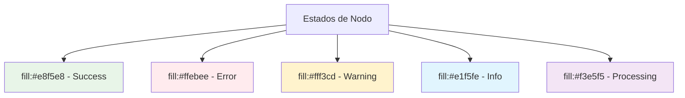

# 🎨 Guía de Iconos y Estilos - Backstage Solutions

[](#)
[](#)

> **Sistema unificado de iconos y estilos** para mantener consistencia visual en toda la documentación de Backstage Solutions.

## 📋 Sistema de Iconos

### 🎯 **Iconos por Categoría**

#### 🏗️ **Arquitectura y Estructura**
- 🏠 **Home/Principal**: `🏠`
- 🏗️ **Arquitectura**: `🏗️`
- 📂 **Directorio/Carpeta**: `📁`
- 📄 **Archivo**: `📄`
- ⚙️ **Configuración**: `⚙️`
- 🔧 **Herramientas**: `🔧`

#### 🚀 **Desarrollo y Despliegue**
- 🚀 **Despliegue/Deploy**: `🚀`
- 🏗️ **Build/Construir**: `🏗️`
- 🐳 **Docker**: `🐳`
- ☸️ **Kubernetes**: `☸️`
- 🔄 **GitOps/CI-CD**: `🔄`
- 📦 **Package**: `📦`

#### 📊 **Monitoreo y Observabilidad**
- 📊 **Monitoreo**: `📊`
- 📈 **Métricas**: `📈`
- 🚨 **Alertas**: `🚨`
- 📊 **Grafana**: `📊`
- 📈 **Prometheus**: `📈`
- 📋 **Logs**: `📋`

#### 🐘 **Base de Datos**
- 🐘 **PostgreSQL**: `🐘`
- 💾 **Storage/Persistencia**: `💾`
- 🔄 **Backup**: `🔄`
- 📊 **Database**: `📊`

#### 🎭 **Aplicaciones y Servicios**
- 🎭 **Backstage**: `🎭`
- 🌐 **Web/Services**: `🌐`
- 🚪 **Ingress**: `🚪`
- 🔗 **API/Endpoints**: `🔗`

#### 🛠️ **Scripts y Automatización**
- 🛠️ **Scripts**: `🛠️`
- 🔄 **Automatización**: `🔄`
- 🤖 **Bot/Automático**: `🤖`
- 📝 **Configuración**: `📝`

#### 🔒 **Seguridad**
- 🔒 **Seguridad**: `🔒`
- 🔐 **Secrets**: `🔐`
- 🛡️ **Protección**: `🛡️`
- 🔑 **Autenticación**: `🔑`

#### 📚 **Documentación**
- 📚 **Documentación**: `📚`
- 📖 **Guía**: `📖`
- 📋 **README**: `📋`
- 🔍 **Búsqueda**: `🔍`

#### 🚨 **Estados y Estados de Error**
- ✅ **Éxito/Success**: `✅`
- ❌ **Error/Fallo**: `❌`
- 🚨 **Problema/Issue**: `🚨`
- ⚠️ **Advertencia**: `⚠️`
- 🔍 **Diagnóstico**: `🔍`
- 🆘 **Ayuda/Troubleshooting**: `🆘`

#### 👥 **Usuarios y Roles**
- 👨‍💻 **Desarrollador**: `👨‍💻`
- ☸️ **DevOps**: `☸️`
- 👥 **Equipo/Team**: `👥`
- 👤 **Usuario**: `👤`

#### ⏰ **Estados Temporales**
- ⏳ **En Progreso**: `⏳`
- ⏰ **Tiempo**: `⏰`
- 🔄 **Actualizando**: `🔄`
- 🆕 **Nuevo**: `🆕`

### 🎨 **Colores y Estilos**

#### 🏷️ **Badges Recomendados**

```markdown
[](https://kubernetes.io/)
[](https://docker.com/)
[](https://backstage.io/)
```

#### 🎨 **Paleta de Colores Mermaid**



### 📝 **Convenciones de Nomenclatura**

#### 📁 **Estructura de Directorios**
```
📁 project/
├── 🎨 IDP/                          # Aplicación principal
├── ☸️ Manifest/                     # Kubernetes manifests
├── 🛠️ Scripts/                      # Utilidades
├── ⚙️ .github/                      # CI/CD
└── 📖 README.md                     # Documentación
```

#### 📄 **Archivos Especiales**
```
📋 README.md                    # Documentación principal
📋 TROUBLESHOOTING.md          # Guía de resolución
📚 DOCS_INDEX.md               # Índice de documentación
🎨 ICONS_GUIDE.md              # Esta guía
📖 GLOSSARY.md                 # Glosario de términos
```

### 🔗 **Enlaces y Referencias**

#### 📎 **Estilos de Enlaces**
- `[Texto](URL)` - Enlace inline
- `[Texto][referencia]` - Enlace por referencia
- `[Texto](URL "Título")` - Enlace con título

#### 🎯 **Referencias Cruzadas**
```markdown
- [🏠 README.md](README.md) - Documentación principal
- [🎨 IDP/README.md](IDP/README.md) - Arquitectura Backstage
- [☸️ Manifest/README.md](Manifest/README.md) - Despliegue K8s
```

### 📊 **Tablas y Listas**

#### 📋 **Tablas Consistentes**
```markdown
| Columna 1 | Columna 2 | Descripción |
|-----------|-----------|-------------|
| 👨‍💻 | Desarrollador | Rol técnico |
| ☸️ | DevOps | Infraestructura |
```

#### 📝 **Listas Jerárquicas**
```markdown
1. **Nivel 1**
   - **Sub-nivel 1.1**
     - Sub-sub-nivel 1.1.1
   - **Sub-nivel 1.2**
2. **Nivel 2**
```

### 💡 **Consejos para Mantener Consistencia**

#### ✅ **Buenas Prácticas**

1. **🔄 Consistencia**: Usa siempre los mismos iconos para conceptos similares
2. **📖 Claridad**: Elige iconos intuitivos y descriptivos
3. **🎯 Relevancia**: Los iconos deben relacionarse con el contenido
4. **📏 Moderación**: No sobrecargues con demasiados iconos
5. **🔄 Actualización**: Revisa y actualiza cuando sea necesario

#### ❌ **Evitar**

- ❌ **Iconos genéricos**: No uses `📄` para todo tipo de archivo
- ❌ **Inconsistencia**: No cambies iconos entre documentos similares
- ❌ **Sobrecarga**: Evita usar iconos en cada línea
- ❌ **Confusión**: No uses iconos que puedan interpretarse de múltiples formas

### 🛠️ **Herramientas de Verificación**

#### 🔍 **Scripts de Validación**

```bash
# Verificar uso consistente de iconos
#!/bin/bash
echo "🔍 Verificando consistencia de iconos..."

# Buscar iconos duplicados o inconsistentes
find docs/ -name "*.md" -exec grep -l "🏠" {} \;

# Contar uso de iconos por documento
find docs/ -name "*.md" -exec bash -c 'echo -n "$1: "; grep -o ":[a-zA-Z0-9_]*:" "$1" | sort | uniq -c | sort -nr' _ {} \;
```

#### 📊 **Métricas de Calidad**

- **Consistencia**: >90% de iconos usados consistentemente
- **Cobertura**: Iconos en secciones principales
- **Claridad**: Iconos intuitivos y descriptivos
- **Mantenibilidad**: Fácil actualización del sistema

### 📈 **Evolución del Sistema**

#### 🔄 **Versionado de Iconos**

| Versión | Fecha | Cambios |
|---------|-------|---------|
| v1.0 | 2024-01-XX | Sistema inicial de iconos |
| v1.1 | 2024-01-XX | Agregados iconos de estado |
| v1.2 | 2024-01-XX | Iconos de CI/CD |

#### 🚀 **Mejoras Futuras**

- [ ] **Iconos Interactivos**: Enlaces a documentación
- [ ] **Temas**: Soporte para diferentes temas visuales
- [ ] **Automatización**: Generación automática de índices
- [ ] **Validación**: Scripts de verificación automática

---

## 🎯 **Referencias Rápidas**

### 📚 **Documentos por Icono**

| Icono | Uso Principal | Ejemplos |
|-------|---------------|----------|
| 🏠 | Home/Principal | README.md principal |
| 🎨 | Aplicación/IDP | Directorio IDP/ |
| ☸️ | Kubernetes | Directorio Manifest/ |
| 🛠️ | Scripts | Directorio Scripts/ |
| ⚙️ | Configuración | .github/, configs |
| 📊 | Monitoreo | monitoring/, métricas |
| 🐘 | Base de datos | postgres/, BD |
| 🚀 | CI/CD | pipelines, despliegues |

### 🔍 **Búsqueda por Función**

**Navegación**: 🏠 🏗️ 📂
**Desarrollo**: 🚀 🏗️ 🐳 ☸️
**Monitoreo**: 📊 📈 🚨
**Base de datos**: 🐘 💾 🔄
**Seguridad**: 🔒 🔐 🛡️
**Documentación**: 📚 📖 📋

---

<div align="center">

**🎨 Iconos que hacen la documentación más atractiva**

*¡La consistencia visual mejora la experiencia del desarrollador!*

[](https://github.com/Portfolio-jaime)
[](https://daringfireball.net/projects/markdown/)

</div>