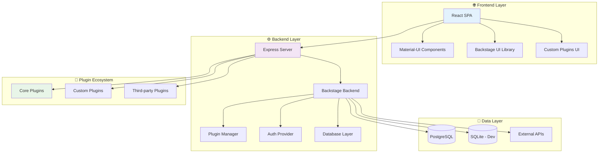
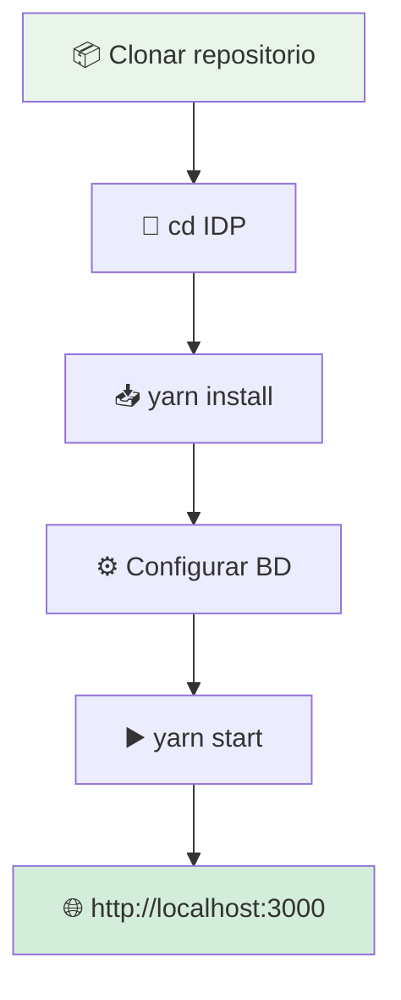
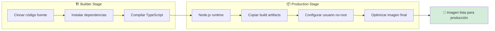
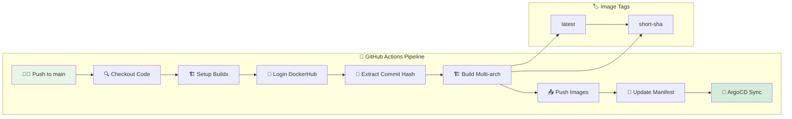
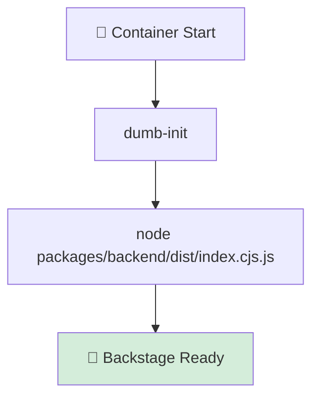
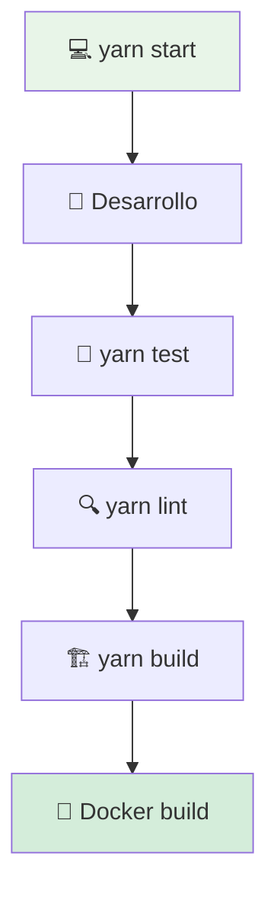
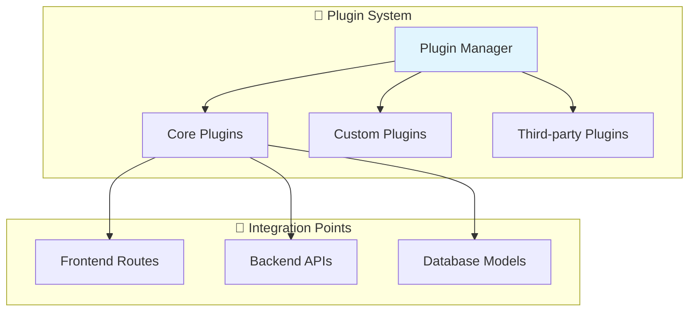
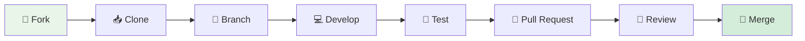

# 🎨 Backstage IDP - Internal Developer Platform

[](https://backstage.io/)
[](https://reactjs.org/)
[](https://www.typescriptlang.org/)
[](https://nodejs.org/)
[](https://postgresql.org/)

> Una aplicación **Backstage personalizada** que proporciona un portal de desarrollador interno unificado para gestionar servicios, herramientas y documentación con arquitectura modular y extensible.

## 📋 Descripción General

Backstage es una plataforma de código abierto creada por Spotify para construir **portales de desarrolladores enterprise**. Esta implementación incluye una arquitectura completa con componentes modulares, plugins personalizados y integración con herramientas de desarrollo modernas.

### ✨ Características Principales

- 🎯 **Catálogo de Servicios**: Gestión centralizada de componentes, APIs y recursos
- 📚 **Documentación Técnica**: Portal unificado con TechDocs integrado
- 🔧 **Herramientas de Desarrollo**: Integración nativa con CI/CD, monitoreo y SCM
- 🏗️ **Plantillas de Proyecto**: Scaffolding automatizado con Scaffolder
- 🔍 **Búsqueda Unificada**: Motor de búsqueda inteligente con filtros avanzados
- 🔌 **Plugins Extensibles**: Arquitectura modular para funcionalidades personalizadas

## 🏗️ Arquitectura del Sistema



## 📂 Estructura del Proyecto

```
🎨 IDP/
├── 📦 packages/                    # 🏠 Paquetes principales
│   ├── 🎭 app/                     # 🎨 Frontend React SPA
│   │   ├── 📱 src/components/      # 🧩 Componentes UI
│   │   ├── 🖼️ public/             # 📁 Assets estáticos
│   │   └── 📋 src/apis.ts          # 🔗 Configuración APIs
│   └── ⚙️ backend/                 # 🔧 Backend Node.js
│       ├── 📁 src/                 # 💻 Código fuente
│       ├── 🐳 Dockerfile           # 📦 Containerización
│       └── 📋 package.json         # 📦 Dependencias
├── 🔌 plugins/                     # 🧩 Plugins personalizados
│   └── 📁 custom-plugin/           # 🔧 Plugin de ejemplo
├── 📋 examples/                    # 📖 Ejemplos y templates
│   ├── 📄 entities.yaml            # 🎯 Entidades de catálogo
│   └── 🏗️ template/                # 📋 Plantilla de proyecto
├── ⚙️ app-config.yaml              # 🔧 Configuración desarrollo
├── 🚀 app-config.production.yaml   # 🔧 Configuración producción
├── 📋 backstage.json               # 🏷️ Metadatos Backstage
├── 📦 package.json                 # 📦 Dependencias raíz
└── 🔒 yarn.lock                    # 🔐 Lockfile dependencias
```

## 🛠️ Tecnologías y Versiones

| Componente | Tecnología | Versión | Propósito |
|------------|------------|---------|-----------|
| 🎯 **Framework** | Backstage | v1.44.0 | Plataforma base |
| 🎨 **Frontend** | React + TypeScript | v18.x | UI interactiva |
| ⚙️ **Backend** | Node.js + Express | v20.x | API server |
| 💾 **Base de Datos** | PostgreSQL | v15.x | Persistencia datos |
| 📦 **Gestión Paquetes** | Yarn | v4.x | Dependency management |
| 🧪 **Testing E2E** | Playwright | v1.x | Pruebas automatizadas |
| 🐳 **Containerización** | Docker | v24.x | Empaquetado aplicación |

> Nota: El `Dockerfile` oficial ahora vive únicamente en `IDP/Dockerfile` (se eliminó la carpeta raíz `Docker/`). Se simplificó la etapa `runtime` para copiar un único árbol `node_modules` consolidado y evitar errores de rutas inexistentes en workspaces.
>
> Optimización adicional: Solo se enfocan dependencias de producción del backend (`yarn workspaces focus backend --production`), reduciendo el tamaño de la imagen y tiempo de build. Se añadió un `HEALTHCHECK` que intenta `/health` o `/healthcheck`.

## 🚀 Guías de Inicio Rápido

### ⚡ Desarrollo Local (3 minutos)

#### 📋 Prerrequisitos

| Requisito | Versión | Comando de verificación |
|-----------|---------|------------------------|
| 🟢 **Node.js** | 20.x o 22.x | `node --version` |
| 📦 **Yarn** | 4.x | `yarn --version` |
| 🐘 **PostgreSQL** | 15.x | `psql --version` |
| 🐳 **Docker** | 24.x (opcional) | `docker --version` |

#### 🛠️ Instalación y Ejecución



```bash
# 1. Instalar dependencias del proyecto
yarn install

# 2. Configurar base de datos PostgreSQL
# Crear base de datos y usuario según app-config.yaml

# 3. Iniciar servidor de desarrollo
yarn start

# 4. Acceder a la aplicación
# http://localhost:3000
```

### 🐳 Producción con Docker

#### 🏗️ Imagen Multi-stage Optimizada



El Dockerfile multi-stage optimiza el proceso de construcción:

1. **🏗️ Builder Stage**: Compila código TypeScript y dependencias
2. **📦 Production Stage**: Crea imagen final minimalista
3. **🔒 Security**: Usuario no-root y dependencias de producción únicamente
4. **📊 Performance**: Imagen optimizada para startup rápido

### 🔧 Arquitectura de Build Optimizada (Etapas reales)

La versión actual del `Dockerfile` usa 4 etapas separadas para mejorar cache y seguridad:

| Etapa | Imagen Base | Propósito | Detalles |
|-------|-------------|-----------|----------|
| deps | node:20-alpine | Instala dependencias completas (dev+prod) para cache estable | Sólo manifiestos copiados antes del código → cambios en src no invalidan esta capa |
| builder | node:20-alpine (FROM deps) | Compila frontend (`packages/app/dist`) y backend (`packages/backend/dist`) | Usa dev deps; ejecuta `yarn build:all` |
| prod-deps | node:20-alpine | Instala sólo deps de producción del backend | `yarn workspaces focus backend --production` reduce tamaño |
| runtime | node:20-alpine | Imagen final mínima con dist + assets + deps backend | Copia `dist` y `node_modules` necesarios; `USER node` aplicado |

#### 📁 Variable `APP_DIST_DIR`
Se define `APP_DIST_DIR=/app/packages/app/dist` en runtime para facilitar servir assets del frontend. Si decides extraer el frontend a un contenedor separado o CDN:
1. Elimina el `COPY --from=builder /app/packages/app/dist ...` del Dockerfile.
2. Ajusta `app.baseUrl` en `app-config.production.yaml` al nuevo dominio.
3. Implementa un Deployment/Job que publique los assets (ejemplo Nginx) o pipeline que suba a S3/CDN.

#### 🧪 Comprobación rápida
```bash
docker run --rm -p 7007:7007 backstage-backend-test \
    sh -c 'wget -qO- localhost:7007/health && echo OK'
```

#### 🛡️ Beneficios
- Cache granular → builds incrementales más rápidos.
- Menor superficie de ataque al excluir toolchain en runtime.
- Facilita migrar a base distroless en el futuro.

#### 🚀 Próximas optimizaciones sugeridas
- `--mount=type=cache,target=/app/.yarn/cache` en etapas que ejecutan `yarn install`.
- Usar `node:20-alpine` con eliminación explícita de páginas de man y cache apk (`rm -rf /var/cache/apk/*`).
- Explorar imagen distroless (`gcr.io/distroless/nodejs20-debian12`) si las libs nativas funcionan.
- Escaneo de vulnerabilidades automático (Trivy/Docker Scout) en CI.

#### 📏 Sobre los tiempos de build
Paquetes con binarios (`better-sqlite3`, `isolated-vm`) prolongan el build inicial. Con cache de `deps`/`prod-deps`, las reconstrucciones sólo recompilan código y reducen el tiempo total.

---

#### 🏃‍♂️ Build y Ejecución

```bash
# Construir imagen local
docker build -f Dockerfile -t backstage:local .

# Ejecutar contenedor
docker run --rm -p 7007:7007 \
  --env-file .env \
  backstage:local
```

## 🔄 Pipeline CI/CD Automatizado

Documentación ampliada del pipeline: ver `../.github/workflows/docker-image.yml`. Los manifests que consume ArgoCD para Backstage y monitoreo están en `../Manifest/backstage/` y `../Manifest/monitoring/` respectivamente.

### 🚀 GitHub Actions Workflow



#### ⚙️ Configuración del Workflow

**Archivo**: `.github/workflows/docker-image.yml`

**Características principales**:
- 🏗️ **Multi-plataforma**: `linux/amd64`, `linux/arm64`
- 🏷️ **Versionado automático**: Tags `latest` y `<commit-hash>`
- 🔄 **GitOps**: Actualización automática de manifests
- 🛡️ **Seguridad**: Secrets encriptados

#### 📦 Imágenes Publicadas

```bash
# Tags generados automáticamente
jaimehenao8126/backstage-custom:latest
jaimehenao8126/backstage-custom:a1b2c3d
```

#### 🔄 Actualización Automática

```yaml
# Manifest actualizado automáticamente
spec:
  template:
    spec:
      containers:
      - name: backstage
        image: jaimehenao8126/backstage-custom:a1b2c3d
```

### 🏃‍♂️ Runtime y Optimización

#### ⚡ Entrypoint Optimizado



**Beneficios del approach compilado**:
- 📦 **Imagen más pequeña**: Sin código fuente TypeScript
- 🚀 **Startup más rápido**: Código pre-compilado
- 🔒 **Mejor seguridad**: Solo runtime necesario
- 📊 **Performance**: Optimizaciones de Node.js aplicadas

## 🆘 Troubleshooting Avanzado

### 🔍 Diagnóstico de Problemas Comunes

| 🚨 Problema | 🔍 Causa Común | ✅ Solución |
|-------------|----------------|-------------|
| `MODULE_NOT_FOUND` | Script espera código fuente | Usar Dockerfile multi-stage |
| 📝 Commit vacío falla | Sin cambios en repo | Verificación automática implementada |
| 🖼️ Imagen no actualiza | ArgoCD no sincronizó | `argocd app sync backstage` |
| 🔐 Auth falla | Credenciales expiradas | Rotar secrets en DockerHub |
| 🏗️ Build falla | Dependencias corruptas | `rm -rf node_modules && yarn install` |

### 🛠️ Comandos de Debug

```bash
# Ver logs del contenedor local
docker run --rm backstage:local --help

# Verificar imagen en DockerHub
docker pull jaimehenao8126/backstage-custom:latest

# Ver estado del workflow
gh run list --workflow=docker-image.yml
```

## 📋 Roadmap y Mejoras Futuras

### 🚀 Próximas Funcionalidades

- [ ] 📊 **Métricas Personalizadas**: Integración con `kube-prometheus-stack`
- [ ] 🚨 **Alertas Avanzadas**: Alertmanager con Slack/Email
- [ ] 📚 **TechDocs Mejorado**: Generación automática de docs
- [ ] 🏗️ **Scaffolder Templates**: Plantillas personalizadas
- [ ] 🔍 **Search Avanzado**: Búsqueda semántica
- [ ] 🔌 **Plugin Marketplace**: Catálogo de plugins internos

### 🛠️ Mejoras Técnicas

- [ ] 💾 **Cache de Build**: Acelerar pipelines CI/CD
- [ ] 🧪 **Testing Automatizado**: Cobertura completa
- [ ] 📈 **Performance Monitoring**: APM integrado
- [ ] 🔄 **Auto-scaling**: Configuración HPA
- [ ] 🏗️ **Multi-stage Avanzado**: Optimizaciones adicionales

## 🛠️ Scripts y Comandos

### 📋 Comandos Disponibles

| Comando | Descripción | Uso Típico |
|---------|-------------|-------------|
| `yarn start` | 🚀 Servidor de desarrollo | Desarrollo local |
| `yarn build` | 🏗️ Build de producción | CI/CD pipeline |
| `yarn test` | 🧪 Pruebas unitarias | Validación código |
| `yarn test:e2e` | 🤖 Pruebas E2E Playwright | Testing completo |
| `yarn lint` | 🔍 Linting código | Calidad código |
| `yarn fix` | 🔧 Auto-fix linting | Corrección automática |

### 📊 Workflow de Desarrollo



## ⚙️ Configuración del Sistema

### 🏠 Desarrollo Local

**Archivo**: `app-config.yaml`

```yaml
app:
  title: Backstage IDP
  baseUrl: http://localhost:3000

backend:
  baseUrl: http://localhost:7007
  listen:
    port: 7007

database:
  client: pg
  connection:
    host: localhost
    port: 5432
    user: backstage
    password: password
    database: backstage
```

### 🚀 Producción

**Archivo**: `app-config.production.yaml`

**Características optimizadas**:
- 🔒 Configuración de seguridad avanzada
- 📊 Logging estructurado
- 🔄 Health checks
- 📈 Métricas de performance
- 🔐 Secrets management

## 🔌 Plugins y Extensiones

### 📦 Plugins Core Incluidos

| Plugin | Función | Estado |
|--------|---------|--------|
| 🎭 **Catálogo** | Gestión entidades | ✅ Activo |
| 🔍 **Búsqueda** | Motor de búsqueda | ✅ Activo |
| 🏗️ **Scaffolder** | Plantillas proyectos | ✅ Activo |
| 📚 **TechDocs** | Documentación | ✅ Activo |
| 🔐 **Auth** | Autenticación | ✅ Activo |

### 🧩 Arquitectura de Plugins



## 🤝 Guía de Contribución

### 📋 Proceso de Desarrollo



### 🛠️ Configuración para Contribuidores

1. **Clonar y configurar**:
   ```bash
   git clone https://github.com/Portfolio-jaime/Backstage-Manual.git
   cd IDP
   yarn install
   ```

2. **Configurar entorno**:
   ```bash
   cp app-config.yaml app-config.local.yaml
   # Personalizar configuración local
   ```

3. **Ejecutar tests**:
   ```bash
   yarn test
   yarn test:e2e
   ```

### 📝 Estándares de Código

- 🔍 **Linting**: ESLint + Prettier
- 🧪 **Testing**: Jest + React Testing Library
- 📚 **Documentación**: TypeDoc para APIs
- 🔄 **Commits**: Conventional commits

## 📞 Soporte y Comunidad

### 🆘 Canales de Ayuda

- 📖 **Documentación Oficial**: [backstage.io/docs](https://backstage.io/docs)
- 🐛 **Issues**: [GitHub Issues](https://github.com/Portfolio-jaime/Backstage-Manual/issues)
- 💬 **Discusiones**: [GitHub Discussions](https://github.com/Portfolio-jaime/Backstage-Manual/discussions)
- 📧 **Email**: jaimehenao8126@outlook.com

### 🌟 Comunidad

- 🤝 **Contribuciones abiertas**
- 📚 **Documentación colaborativa**
- 💡 **Innovación continua**
- 🌍 **Adopción global**

---

<div align="center">

**🎉 Gracias por contribuir al proyecto Backstage IDP**

*Para más información, visita [backstage.io](https://backstage.io)*

</div>
