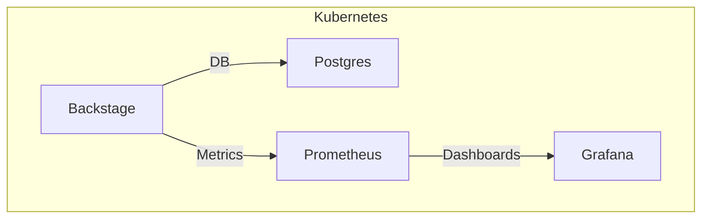

# 📦 Manifiestos de Kubernetes

Esta carpeta contiene todos los archivos de configuración para desplegar Backstage, PostgreSQL y el stack de monitoreo en Kubernetes.

## 📂 Estructura

```
Manifest/
├── backstage/    # Backstage y ArgoCD
├── postgres/     # PostgreSQL
├── monitoring/   # Prometheus y Grafana
├── ns.yaml       # Namespace
└── storageclass-manual.yaml # StorageClass
```

## 🔗 Diagrama de Dependencias



## 📑 Guía Rápida

1. Aplica el namespace y storage class:
   ```bash
   kubectl apply -f ns.yaml
   kubectl apply -f storageclass-manual.yaml
   ```
2. Aplica los recursos de cada stack:
   ```bash
   kubectl apply -f backstage/
   kubectl apply -f postgres/
   kubectl apply -f monitoring/
   ```

## 🗂️ Detalle de Carpetas

- **backstage/**: Deployment, Service, Ingress, Secrets y ArgoCD Application de Backstage.
- **postgres/**: Deployment, Service, Secrets, PV/PVC y ArgoCD Application de PostgreSQL.
- **monitoring/**: ArgoCD Application Helm (`kube-prometheus-stack`) + `values.yaml` (ya NO se usan manifiestos manuales separados para Prometheus/Grafana).

## 📝 TODO
- [ ] Añadir ConfigMaps de dashboards personalizados (Grafana)
- [ ] Integrar Alertmanager receivers (Slack / Email)
- [ ] Revisar rotación y cifrado de secrets
- [ ] Añadir validación automática (kubeconform / OPA) en CI

---
**Desarrollado con ❤️ por Jaime Henao**