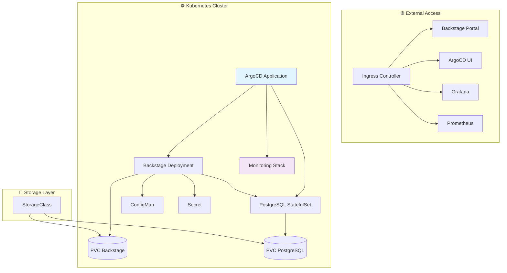
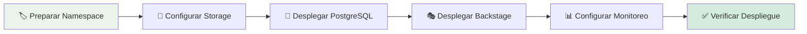
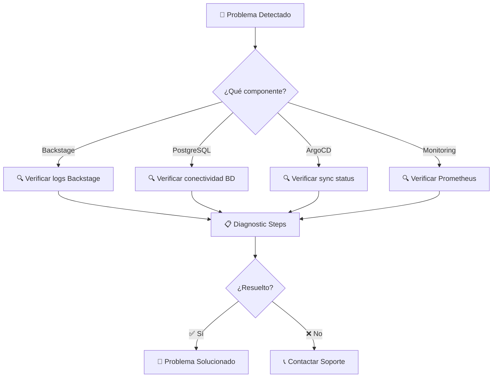

# ☸️ Manifiestos de Kubernetes - Backstage IDP

[](https://kubernetes.io/)
[](https://argo-cd.readthedocs.io/)
[](https://helm.sh/)

> **Manifiestos completos** para desplegar la plataforma Backstage IDP en Kubernetes con GitOps, persistencia y monitoreo integrado.

## 📋 Descripción General

Esta carpeta contiene todos los **manifiestos de Kubernetes** necesarios para desplegar la plataforma Backstage completa en un clúster Kubernetes. Utiliza una arquitectura GitOps con ArgoCD y Helm charts para facilitar el despliegue y mantenimiento.

### ✨ Características Principales

- 🎯 **GitOps First**: Despliegue automatizado con ArgoCD
- 💾 **Persistencia**: PostgreSQL con PV/PVC dedicados
- 📊 **Monitoreo**: Stack completo Prometheus + Grafana
- 🔒 **Seguridad**: Secrets management y RBAC
- 🚀 **Escalabilidad**: Configuración preparada para HPA

## 🏗️ Arquitectura de Despliegue



## 📂 Estructura del Proyecto

```
📁 Manifest/
├── 🏷️ ns.yaml                           # 🏷️ Namespace 'backstage-manual'
├── 💽 storageclass-manual.yaml          # 💽 StorageClass para persistencia
├── 🎭 backstage/                        # 🎪 Recursos Backstage + ArgoCD
│   ├── 📋 backstage-app.yaml            # 🎯 ArgoCD Application
│   ├── 🚀 deploy-backstage.yaml         # 🚀 Deployment Backstage
│   ├── 🌐 service-backstage.yaml        # 🌐 Service ClusterIP
│   ├── 🚪 ingress-backstage.yaml        # 🚪 Ingress HTTP
│   └── 🔐 secret-backstage.yaml         # 🔐 Secrets aplicación
├── 🐘 postgres/                         # 💾 Recursos PostgreSQL
│   ├── 📋 postgres-app.yaml             # 🎯 ArgoCD Application
│   ├── 🚀 deploy-postgres.yaml          # 🚀 Deployment PostgreSQL
│   ├── 🌐 service-postgres.yaml         # 🌐 Service ClusterIP
│   ├── 💽 pv.yaml & pvc.yaml            # 💽 Persistencia dedicada
│   └── 🔐 secret-postgres.yaml          # 🔐 Credenciales BD
└── 📊 monitoring/                       # 📈 Stack de monitoreo
    ├── 📋 monitoring-app.yaml           # 🎯 ArgoCD Application Helm
    └── ⚙️ values.yaml                    # ⚙️ Personalización kube-prometheus-stack
```

## 🚀 Guía de Despliegue Rápido

### ⚡ Despliegue Express (5 minutos)



#### 🛠️ Comandos de Despliegue

```bash
# 1. Preparar infraestructura base
kubectl apply -f ns.yaml
kubectl apply -f storageclass-manual.yaml

# 2. Verificar preparación
kubectl get namespaces
kubectl get storageclass

# 3. Desplegar componentes (orden importante)
kubectl apply -f postgres/
kubectl apply -f backstage/
kubectl apply -f monitoring/

# 4. Verificar despliegue completo
kubectl get all -n backstage-manual
kubectl get ingress -n backstage-manual
```

### 📊 Verificación de Servicios

| Servicio | Comando de Verificación | Estado Esperado |
|----------|------------------------|------------------|
| 🐘 **PostgreSQL** | `kubectl get pods -l app=postgres` | `Running` |
| 🎭 **Backstage** | `kubectl get pods -l app=backstage` | `Running` |
| 📊 **Prometheus** | `kubectl get pods -l app.kubernetes.io/name=prometheus` | `Running` |
| 📈 **Grafana** | `kubectl get pods -l app.kubernetes.io/name=grafana` | `Running` |

## 🔧 Configuración Avanzada

### ⚙️ Personalización por Entorno

#### 🏠 Desarrollo
```yaml
# Configuración ligera para desarrollo
resources:
  requests:
    memory: "256Mi"
    cpu: "100m"
  limits:
    memory: "512Mi"
    cpu: "500m"
```

#### 🚀 Producción
```yaml
# Configuración optimizada para producción
resources:
  requests:
    memory: "1Gi"
    cpu: "500m"
  limits:
    memory: "2Gi"
    cpu: "1000m"
```

### 🔒 Gestión de Secrets

#### 🛡️ Mejores Prácticas
- 🔐 **Nunca commitear** valores reales en el repositorio
- 🔄 **Rotación periódica** de credenciales
- 🏦 **External Secrets Operator** recomendado para producción
- 📋 **Sealed Secrets** para cifrado en Git

#### 📝 Ejemplo de Secret Estructurado

```yaml
apiVersion: v1
kind: Secret
metadata:
  name: backstage-secrets
  namespace: backstage-manual
type: Opaque
data:
  # Base64 encoded values
  POSTGRES_PASSWORD: <base64-encoded>
  BACKEND_AUTH_SECRET: <base64-encoded>
  GRAFANA_ADMIN_PASSWORD: <base64-encoded>
```

## 📊 Monitoreo y Observabilidad

### 📈 Métricas Implementadas

| Componente | Métricas | Dashboards |
|------------|----------|------------|
| 🎭 **Backstage** | HTTP requests, errors, latency | Custom Backstage dashboard |
| 🐘 **PostgreSQL** | Connections, queries, locks | PostgreSQL overview |
| ☸️ **Kubernetes** | CPU, memory, network | K8s cluster monitoring |
| 🚀 **ArgoCD** | Sync status, app health | ArgoCD metrics |

### 🚨 Alertas Configurables

```yaml
# Ejemplo de regla de alerta
apiVersion: monitoring.coreos.com/v1
kind: PrometheusRule
metadata:
  name: backstage-alerts
spec:
  groups:
  - name: backstage
    rules:
    - alert: BackstageDown
      expr: up{job="backstage"} == 0
      for: 5m
      labels:
        severity: critical
      annotations:
        summary: "Backstage service is down"
```

## 🆘 Troubleshooting Avanzado

### 🔍 Diagnóstico por Componente



### 🛠️ Comandos de Diagnóstico

```bash
# Ver estado general del namespace
kubectl get all -n backstage-manual

# Ver logs de componentes específicos
kubectl logs -f deployment/backstage -n backstage-manual
kubectl logs -f deployment/postgres -n backstage-manual

# Ver eventos del cluster
kubectl get events -n backstage-manual --sort-by=.metadata.creationTimestamp

# Ver métricas de recursos
kubectl top pods -n backstage-manual

# Ver configuración de ArgoCD
kubectl get applications -n argocd
```

## 📝 Roadmap y Mejoras

### 🚀 Próximas Funcionalidades

- [ ] 🔐 **External Secrets**: Integración con ESO para gestión avanzada
- [ ] 📊 **Service Mesh**: Istio para observabilidad mejorada
- [ ] 🚀 **Auto-scaling**: HPA y VPA para optimización de recursos
- [ ] 🏗️ **Multi-cluster**: Soporte para despliegues multi-cluster
- [ ] 📈 **Cost Monitoring**: Análisis de costos por componente
- [ ] 🔄 **Backup Automático**: Estrategias de respaldo distribuidas

### 🛠️ Mejoras Técnicas

- [ ] 📋 **GitOps Avanzado**: Kustomize para personalización
- [ ] 🧪 **Testing**: Validación automática de manifiestos
- [ ] 📊 **Performance**: Optimización de recursos y startup
- [ ] 🔍 **Security Scanning**: Escaneo automático de vulnerabilidades
- [ ] 📚 **Documentation**: Docs generadas automáticamente

## 🤝 Contribución

### 📋 Guía para Contribuidores

1. **📖 Revisar documentación** existente antes de modificar
2. **🔍 Validar cambios** con `kubectl apply --dry-run`
3. **🧪 Probar en entorno** de desarrollo primero
4. **📝 Actualizar documentación** si es necesario
5. **🔄 Crear PR** con descripción detallada

### 🏷️ Convenciones de Nomenclatura

- **Namespaces**: `backstage-{environment}`
- **Labels**: `app: {component-name}`
- **Secrets**: `{component}-secrets`
- **ConfigMaps**: `{component}-config`

## 📞 Soporte

### 🆘 Canales de Ayuda

- 📧 **Email**: jaimehenao8126@outlook.com
- 🐛 **Issues**: [GitHub Issues](https://github.com/Portfolio-jaime/Backstage-Manual/issues)
- 📖 **Kubernetes Docs**: [kubernetes.io](https://kubernetes.io/docs)
- 🎯 **ArgoCD Docs**: [argo-cd.readthedocs.io](https://argo-cd.readthedocs.io/)

---

<div align="center">

**☸️ Desarrollado con ❤️ para la comunidad Kubernetes**

*¡Contribuciones y mejoras son siempre bienvenidas!*

</div>