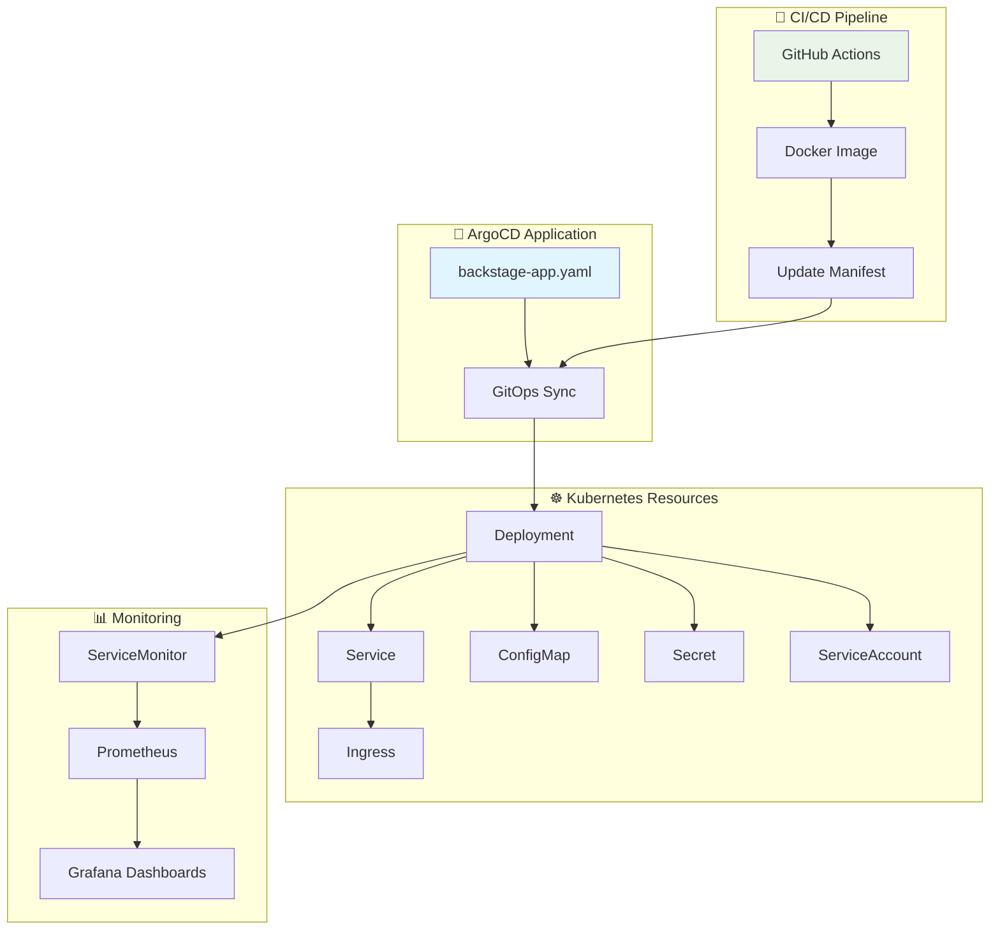
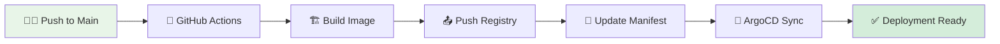
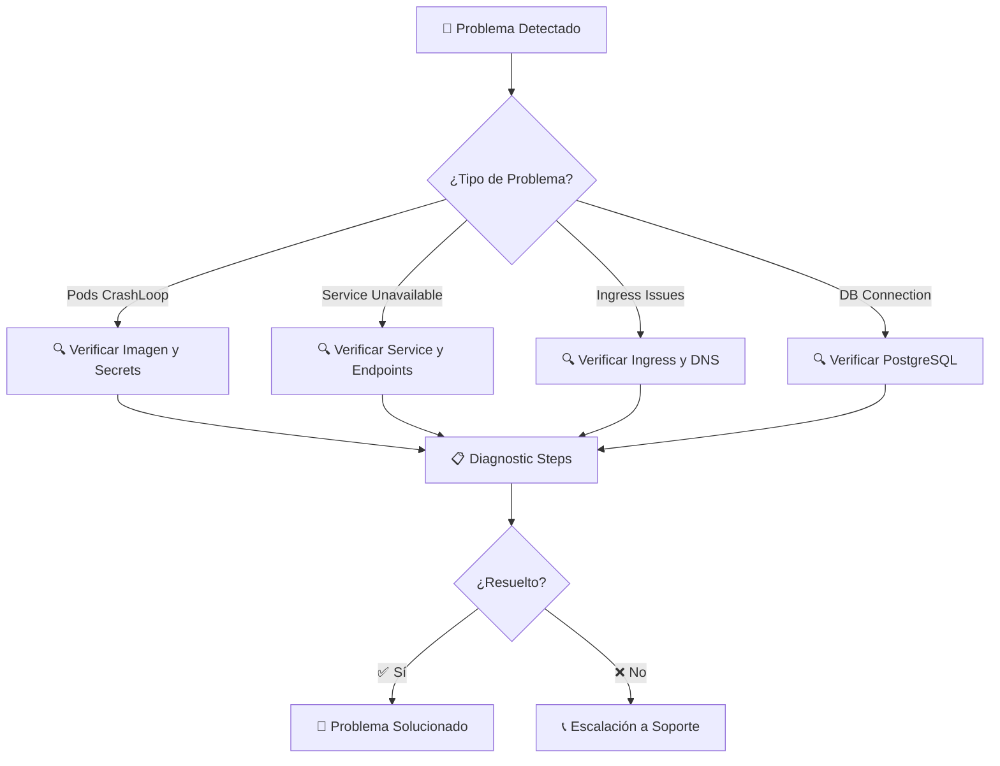
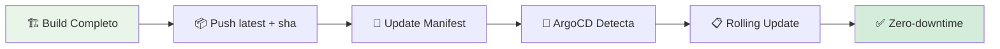

# 🎭 Backstage Deployment - Manifiestos Kubernetes

[](https://kubernetes.io/)
[](https://argo-cd.readthedocs.io/)
[](https://backstage.io/)

> **Manifiestos completos** para desplegar la aplicación Backstage en Kubernetes con GitOps, escalabilidad y alta disponibilidad.

## 📋 Descripción General

Esta carpeta contiene todos los **manifiestos de Kubernetes** necesarios para desplegar la aplicación Backstage en un clúster Kubernetes. Utiliza ArgoCD para GitOps y está optimizado para entornos de producción con monitoreo integrado.

### ✨ Características Principales

- 🚀 **GitOps Ready**: Despliegue automatizado con ArgoCD
- 📊 **Monitoreo Integrado**: ServiceMonitor para Prometheus
- 🔒 **Seguridad**: Secrets management y RBAC
- 📈 **Escalabilidad**: Preparado para HPA
- 🌐 **Networking**: Ingress con configuración SSL-ready

## 🏗️ Arquitectura de Despliegue



## 📂 Estructura de Manifiestos

```
📁 backstage/
├── 📋 backstage-app.yaml           # 🎯 ArgoCD Application definition
├── 🚀 deploy-backstage.yaml        # 🚀 Main deployment with containers
├── 🌐 service-backstage.yaml       # 🌐 ClusterIP service (port 7007)
├── 🚪 ingress-backstage.yaml       # 🚪 HTTP ingress configuration
├── 🔐 secret-backstage.yaml        # 🔐 Application secrets & credentials
├── 📊 servicemonitor.yaml          # 📊 Prometheus metrics collection
└── 📋 README.md                    # 📖 This documentation
```

## 🚀 Guía de Despliegue

### ⚡ Despliegue Automático (GitOps)



#### 🛠️ Comandos de Despliegue Manual

```bash
# Desplegar vía ArgoCD (recomendado)
kubectl apply -f backstage-app.yaml

# O desplegar manualmente
kubectl apply -f deploy-backstage.yaml
kubectl apply -f service-backstage.yaml
kubectl apply -f ingress-backstage.yaml
kubectl apply -f secret-backstage.yaml
```

### 📊 Verificación de Despliegue

```bash
# Ver estado del deployment
kubectl get deployment backstage -n backstage-manual

# Ver pods activos
kubectl get pods -l app=backstage -n backstage-manual

# Ver logs de la aplicación
kubectl logs -f deployment/backstage -n backstage-manual

# Ver configuración de ingress
kubectl get ingress backstage -n backstage-manual
```

## ⚙️ Configuración Avanzada

### 🔧 Variables de Entorno Críticas

| Variable | Descripción | Requerido | Ejemplo |
|----------|-------------|-----------|---------|
| `POSTGRES_HOST` | Host de PostgreSQL | ✅ | `postgres.backstage-manual.svc.cluster.local` |
| `POSTGRES_PORT` | Puerto de PostgreSQL | ✅ | `5432` |
| `POSTGRES_DB` | Nombre de la base de datos | ✅ | `backstage` |
| `POSTGRES_USER` | Usuario de PostgreSQL | ✅ | `backstage` |
| `POSTGRES_PASSWORD` | Contraseña de PostgreSQL | ✅ | `secure-password` |
| `BACKEND_AUTH_SECRET` | Secret para autenticación | ✅ | `random-secret-key` |
| `BASE_URL` | URL base de Backstage | ✅ | `https://backstage.local` |

### 📊 Recursos y Límites

```yaml
resources:
  requests:
    memory: "512Mi"
    cpu: "250m"
  limits:
    memory: "1Gi"
    cpu: "500m"

# Configuración de HPA (opcional)
hpa:
  minReplicas: 2
  maxReplicas: 10
  targetCPUUtilizationPercentage: 70
```

### 🔒 Gestión de Secrets

#### 🛡️ Mejores Prácticas de Seguridad

- 🔐 **Nunca commitear** valores reales en el repositorio
- 🔄 **Rotar periódicamente** todas las credenciales
- 🏦 **Usar External Secrets Operator** en producción
- 📋 **Implementar Sealed Secrets** para GitOps

#### 📝 Estructura del Secret

```yaml
apiVersion: v1
kind: Secret
metadata:
  name: backstage-secret
  namespace: backstage-manual
type: Opaque
data:
  # Valores en base64
  POSTGRES_PASSWORD: <base64-encoded-password>
  BACKEND_AUTH_SECRET: <base64-encoded-secret>
  GITHUB_TOKEN: <base64-encoded-token>
```

## 📊 Monitoreo y Observabilidad

### 📈 Métricas Implementadas

```yaml
# ServiceMonitor para Prometheus
apiVersion: monitoring.coreos.com/v1
kind: ServiceMonitor
metadata:
  name: backstage-servicemonitor
spec:
  selector:
    matchLabels:
      app: backstage
  endpoints:
  - port: backstage
    path: /metrics
    interval: 30s
```

#### 📊 Dashboards Recomendados

- **Backstage Application Metrics**: Latencia, errores, requests
- **Kubernetes Resources**: CPU, memoria, red
- **PostgreSQL Integration**: Queries, conexiones, locks

### 🚨 Alertas Configurables

```yaml
# PrometheusRule para alertas
apiVersion: monitoring.coreos.com/v1
kind: PrometheusRule
metadata:
  name: backstage-alerts
spec:
  groups:
  - name: backstage
    rules:
    - alert: BackstageDown
      expr: up{job="backstage"} == 0
      for: 5m
      labels:
        severity: critical
      annotations:
        summary: "Backstage application is down"
```

## 🆘 Troubleshooting Avanzado

### 🔍 Diagnóstico Sistemático



### 🛠️ Comandos de Diagnóstico

```bash
# Ver estado detallado del pod
kubectl describe pod -l app=backstage -n backstage-manual

# Ver logs con seguimiento
kubectl logs -f deployment/backstage -n backstage-manual --previous

# Ver eventos del namespace
kubectl get events -n backstage-manual --sort-by=.metadata.creationTimestamp

# Ver métricas del pod
kubectl top pods -l app=backstage -n backstage-manual

# Ver configuración de ArgoCD
kubectl get applications backstage -n argocd
kubectl describe application backstage -n argocd
```

### 🔧 Soluciones Comunes

| 🚨 Problema | 🔍 Diagnóstico | ✅ Solución |
|-------------|----------------|-------------|
| `CrashLoopBackOff` | `kubectl logs` | Verificar secrets y configuración |
| `ImagePullBackOff` | `kubectl describe pod` | Verificar registry y credenciales |
| `Pending` | `kubectl describe pod` | Verificar recursos y storage |
| `Service Unavailable` | `kubectl get endpoints` | Verificar service selector |
| `Ingress 404` | `kubectl describe ingress` | Verificar host y paths |

## 🔄 Actualización de Imágenes

### 🚀 Flujo de CI/CD



#### 📝 Actualización Manual

```bash
# Actualizar imagen manualmente
kubectl set image deployment/backstage backstage=jaimehenao8126/backstage-custom:new-tag -n backstage-manual

# Verificar rollout
kubectl rollout status deployment/backstage -n backstage-manual

# Rollback si es necesario
kubectl rollout undo deployment/backstage -n backstage-manual
```

## 📈 Escalabilidad y Performance

### 🚀 Horizontal Pod Autoscaler

```yaml
apiVersion: autoscaling/v2
kind: HorizontalPodAutoscaler
metadata:
  name: backstage-hpa
spec:
  scaleTargetRef:
    apiVersion: apps/v1
    kind: Deployment
    name: backstage
  minReplicas: 2
  maxReplicas: 10
  metrics:
  - type: Resource
    resource:
      name: cpu
      target:
        type: Utilization
        averageUtilization: 70
```

### 📊 Optimizaciones de Performance

- **Resource Limits**: Configurados apropiadamente
- **Health Checks**: Liveness y readiness probes
- **Caching**: Configurado para assets estáticos
- **Database Pooling**: Conexiones optimizadas

## 🔮 Extensiones Futuras

### 🚀 Mejoras Planificadas

- [ ] 🔐 **Network Policies**: Restricción de tráfico
- [ ] 📊 **Custom Metrics**: Métricas específicas de negocio
- [ ] 🔄 **Blue-Green Deployments**: Estrategias de despliegue
- [ ] 🏗️ **Multi-region**: Despliegues distribuidos
- [ ] 📈 **Auto-scaling Avanzado**: Basado en métricas custom

### 🛠️ Mejoras Técnicas

- [ ] 💾 **Persistent Config**: Configuración persistente
- [ ] 🔍 **Advanced Logging**: Logs estructurados
- [ ] 📊 **APM Integration**: Application Performance Monitoring
- [ ] 🔄 **GitOps Avanzado**: Kustomize integration
- [ ] 🧪 **Chaos Engineering**: Tests de resiliencia

## 📞 Soporte y Referencias

### 🆘 Canales de Ayuda

- 📧 **Email**: jaimehenao8126@outlook.com
- 🐛 **Issues**: [GitHub Issues](https://github.com/Portfolio-jaime/Backstage-Manual/issues)
- 📖 **Backstage Docs**: [backstage.io/docs](https://backstage.io/docs)
- 🎯 **ArgoCD Docs**: [argo-cd.readthedocs.io](https://argo-cd.readthedocs.io/)

### 📚 Documentación Relacionada

- [`../README.md`](../README.md) - Documentación principal del proyecto
- [`../postgres/README.md`](../postgres/README.md) - Configuración de PostgreSQL
- [`../monitoring/README.md`](../monitoring/README.md) - Stack de monitoreo

---

<div align="center">

**🎭 Desarrollado con ❤️ para despliegues Backstage enterprise**

*¡La documentación se mantiene actualizada con las mejores prácticas!*

</div>
