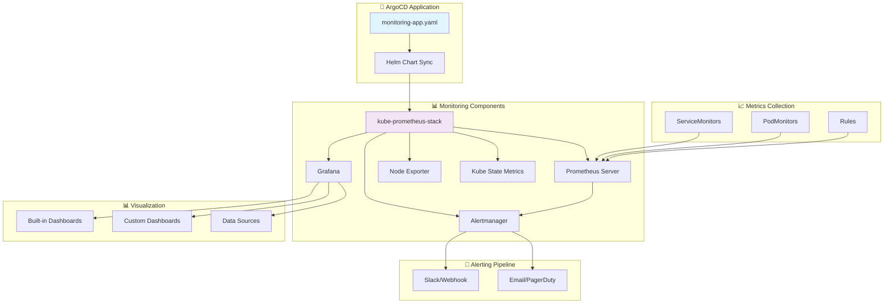
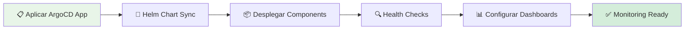
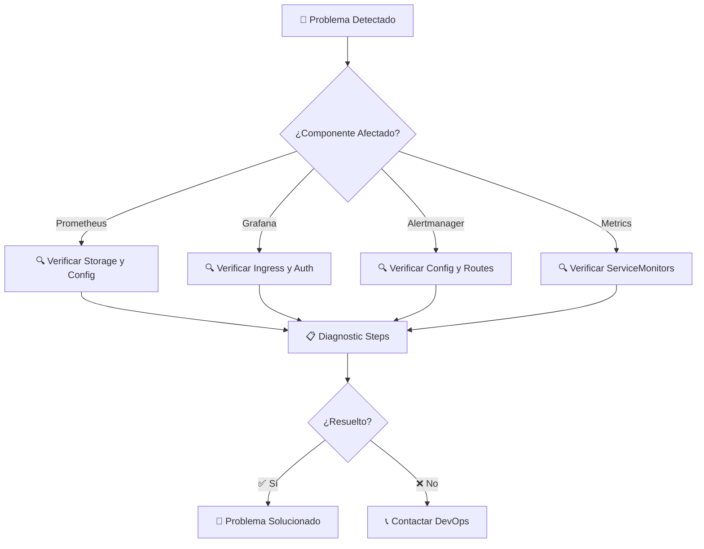

# 📊 Monitoring Stack - Prometheus & Grafana

[](https://prometheus.io/)
[](https://grafana.com/)
[](https://kubernetes.io/)
[](https://helm.sh/)

> **Stack completo de monitoreo** con Prometheus, Grafana y Alertmanager desplegado vía GitOps con ArgoCD y Helm.

## 📋 Descripción General

Esta carpeta contiene la configuración completa del **stack de monitoreo** usando el chart Helm `kube-prometheus-stack`. Proporciona observabilidad completa del clúster Kubernetes y aplicaciones Backstage con dashboards pre-configurados, alertas inteligentes y métricas detalladas.

### ✨ Características Principales

- 📈 **Métricas Completas**: CPU, memoria, red, disco
- 🚨 **Alertas Inteligentes**: Alertmanager con múltiples canales
- 📊 **Dashboards Rich**: Grafana con visualizaciones avanzadas
- 🔄 **GitOps Ready**: Gestión vía ArgoCD
- 📏 **Auto-scaling**: Basado en métricas del clúster
- 🔍 **Service Discovery**: Detección automática de servicios

## 🏗️ Arquitectura del Stack de Monitoreo



## 📂 Estructura de Configuración

```
📁 monitoring/
├── 📋 monitoring-app.yaml           # 🎯 ArgoCD Application definition
├── ⚙️ values.yaml                    # ⚙️ Helm chart customizations
├── 📊 custom-dashboards/            # 📊 Additional Grafana dashboards
│   ├── backstage-dashboard.json     # 🎭 Backstage metrics dashboard
│   └── kubernetes-overview.json     # ☸️ Cluster overview dashboard
├── 🚨 custom-alerts.yaml            # 🚨 Additional Prometheus rules
└── 📋 README.md                     # 📖 This documentation
```

## 🚀 Guía de Despliegue

### ⚡ Despliegue Automático (GitOps)



#### 🛠️ Comandos de Despliegue

```bash
# Despliegue vía ArgoCD (recomendado)
kubectl apply -f monitoring-app.yaml

# Verificación del despliegue
kubectl get pods -n monitoring
kubectl get statefulset -n monitoring
kubectl get ingress -n monitoring
```

### 📊 Verificación de Componentes

```bash
# Ver estado de todos los componentes
kubectl get all -n monitoring

# Ver logs de Prometheus
kubectl logs -f statefulset/prometheus-kube-prometheus-stack-prometheus -n monitoring

# Ver logs de Grafana
kubectl logs -f deployment/kube-prometheus-stack-grafana -n monitoring

# Acceder a servicios
kubectl get ingress -n monitoring
```

## ⚙️ Configuración Avanzada

### 🔧 Personalización del Chart (`values.yaml`)

#### 📊 Configuración de Prometheus

```yaml
prometheus:
  prometheusSpec:
    retention: 30d  # Retención de métricas
    storageSpec:
      volumeClaimTemplate:
        spec:
          storageClassName: manual
          accessModes: ["ReadWriteOnce"]
          resources:
            requests:
              storage: 50Gi
    resources:
      requests:
        memory: 1Gi
        cpu: 500m
      limits:
        memory: 2Gi
        cpu: 1000m
```

#### 📈 Configuración de Grafana

```yaml
grafana:
  adminPassword: "secure-password"
  ingress:
    enabled: true
    hosts:
      - grafana.local
  persistence:
    enabled: true
    size: 10Gi
  dashboardProviders:
    dashboardproviders.yaml:
      apiVersion: 1
      providers:
      - name: 'custom'
        orgId: 1
        folder: 'Custom'
        type: file
        disableDeletion: false
        updateIntervalSeconds: 10
        allowUiUpdates: true
        options:
          path: /var/lib/grafana/dashboards/custom
```

#### 🚨 Configuración de Alertmanager

```yaml
alertmanager:
  config:
    global:
      smtp_smarthost: 'smtp.gmail.com:587'
      smtp_from: 'alerts@company.com'
    route:
      group_by: ['alertname']
      group_wait: 10s
      group_interval: 10s
      repeat_interval: 1h
      receiver: 'slack-notifications'
    receivers:
    - name: 'slack-notifications'
      slack_configs:
      - api_url: 'YOUR_SLACK_WEBHOOK_URL'
        channel: '#alerts'
        send_resolved: true
```

## 📊 Dashboards y Visualizaciones

### 📈 Dashboards Incluidos

| Dashboard | Propósito | Métricas |
|-----------|-----------|----------|
| **Kubernetes Cluster** | Vista general del clúster | CPU, memoria, pods |
| **Kubernetes Nodes** | Métricas por nodo | Uso de recursos, estado |
| **Kubernetes Pods** | Métricas de pods | CPU, memoria, red |
| **Backstage Application** | Métricas específicas | Latencia, errores, requests |
| **PostgreSQL** | Base de datos | Conexiones, queries, locks |

### 🆕 Agregar Dashboards Personalizados

```yaml
# ConfigMap para dashboard personalizado
apiVersion: v1
kind: ConfigMap
metadata:
  name: custom-dashboard
  labels:
    grafana_dashboard: "1"
data:
  custom-dashboard.json: |
    {
      "dashboard": {
        "title": "Custom Backstage Metrics",
        "tags": ["backstage", "custom"],
        "panels": [...]
      }
    }
```

## 🚨 Sistema de Alertas

### 📢 Reglas de Alerta Incluidas

```yaml
# PrometheusRule para alertas críticas
apiVersion: monitoring.coreos.com/v1
kind: PrometheusRule
metadata:
  name: kubernetes-alerts
spec:
  groups:
  - name: kubernetes
    rules:
    - alert: KubernetesPodCrashLooping
      expr: rate(kube_pod_container_status_restarts_total[5m]) > 0
      for: 10m
      labels:
        severity: warning
      annotations:
        summary: "Pod {{ $labels.pod }} is crash looping"
```

### 🔧 Canales de Notificación

#### 📱 Slack Integration

```yaml
alertmanager:
  config:
    receivers:
    - name: 'slack'
      slack_configs:
      - api_url: 'YOUR_SLACK_WEBHOOK'
        channel: '#monitoring'
        title: '{{ .GroupLabels.alertname }}'
        text: '{{ .CommonAnnotations.summary }}'
```

#### 📧 Email Notifications

```yaml
alertmanager:
  config:
    receivers:
    - name: 'email'
      email_configs:
      - to: 'team@company.com'
        from: 'alertmanager@company.com'
        smarthost: 'smtp.company.com:587'
        auth_username: 'alertmanager'
        auth_password: 'password'
```

## 🆘 Troubleshooting Avanzado

### 🔍 Diagnóstico Sistemático



### 🛠️ Comandos de Diagnóstico

```bash
# Ver estado de componentes
kubectl get all -n monitoring

# Ver logs detallados
kubectl logs -f deployment/kube-prometheus-stack-grafana -n monitoring

# Ver métricas disponibles
kubectl port-forward svc/kube-prometheus-stack-prometheus 9090:9090 -n monitoring
# Acceder: http://localhost:9090/targets

# Ver configuración de Grafana
kubectl get secret kube-prometheus-stack-grafana -o jsonpath="{.data.admin-password}" -n monitoring | base64 --decode

# Ver alertas activas
kubectl port-forward svc/kube-prometheus-stack-alertmanager 9093:9093 -n monitoring
# Acceder: http://localhost:9093
```

### 🔧 Soluciones Comunes

| 🚨 Problema | 🔍 Diagnóstico | ✅ Solución |
|-------------|----------------|-------------|
| `PVC Pending` | `kubectl describe pvc` | Verificar StorageClass |
| `Grafana 404` | `kubectl get ingress` | Verificar hosts en ingress |
| `No metrics` | `kubectl get servicemonitor` | Verificar labels de servicios |
| `Alert not firing` | `kubectl describe prometheusrule` | Verificar expresiones |
| `High memory` | `kubectl top` | Aumentar límites de recursos |

## 📈 Optimizaciones y Mejores Prácticas

### 💾 Gestión de Recursos

- **Retención**: 30 días para balancear storage vs utilidad
- **Storage**: SSD recomendado para mejor performance
- **Resources**: Configurar requests/limits apropiados
- **Persistence**: Habilitar para evitar pérdida de datos

### 🔒 Seguridad

- **Network Policies**: Restringir tráfico entre namespaces
- **RBAC**: Configurar acceso granular a Grafana
- **Secrets**: Usar external secret operator
- **TLS**: Habilitar HTTPS en todos los ingresses

### 📊 Monitoreo del Monitoreo

```yaml
# Meta-monitoring: alertas sobre el stack de monitoreo
- alert: PrometheusDown
  expr: up{job="prometheus"} == 0
  for: 5m
  labels:
    severity: critical
  annotations:
    summary: "Prometheus is down"

- alert: GrafanaDown
  expr: up{job="grafana"} == 0
  for: 5m
  labels:
    severity: critical
  annotations:
    summary: "Grafana is down"
```

## 🔮 Extensiones y Evolución

### 🚀 Próximas Funcionalidades

- [ ] 📊 **Custom Metrics**: Métricas específicas de negocio
- [ ] 🔍 **Log Aggregation**: Integración con Loki
- [ ] 📈 **Distributed Tracing**: Jaeger o Zipkin
- [ ] 🤖 **Auto-remediation**: Respuestas automáticas a alertas
- [ ] 📊 **Cost Monitoring**: Análisis de costos por componente
- [ ] 🔄 **Multi-cluster**: Monitoreo federado

### 🛠️ Mejoras Técnicas

- [ ] 💾 **Long-term Storage**: Thanos para retención extendida
- [ ] 📈 **Horizontal Scaling**: Prometheus federation
- [ ] 🔍 **Advanced Queries**: PromQL optimizations
- [ ] 📊 **Custom Plugins**: Grafana plugins específicos
- [ ] 🚀 **Performance Tuning**: Optimizaciones de recursos

## 📞 Soporte y Referencias

### 🆘 Canales de Ayuda

- 📧 **Email**: jaimehenao8126@outlook.com
- 🐛 **Issues**: [GitHub Issues](https://github.com/Portfolio-jaime/Backstage-Manual/issues)
- 📖 **Prometheus Docs**: [prometheus.io/docs](https://prometheus.io/docs/)
- 📊 **Grafana Docs**: [grafana.com/docs](https://grafana.com/docs/)
- ☸️ **kube-prometheus-stack**: [github.com/prometheus-community/helm-charts](https://github.com/prometheus-community/helm-charts/tree/main/charts/kube-prometheus-stack)

### 📚 Documentación Relacionada

- [`../README.md`](../README.md) - Documentación principal del proyecto
- [`../backstage/README.md`](../backstage/README.md) - Configuración de Backstage
- [`../postgres/README.md`](../postgres/README.md) - Base de datos PostgreSQL

---

<div align="center">

**📊 Desarrollado con ❤️ para observabilidad enterprise**

*¡La visibilidad es el primer paso hacia la optimización!*

</div>
