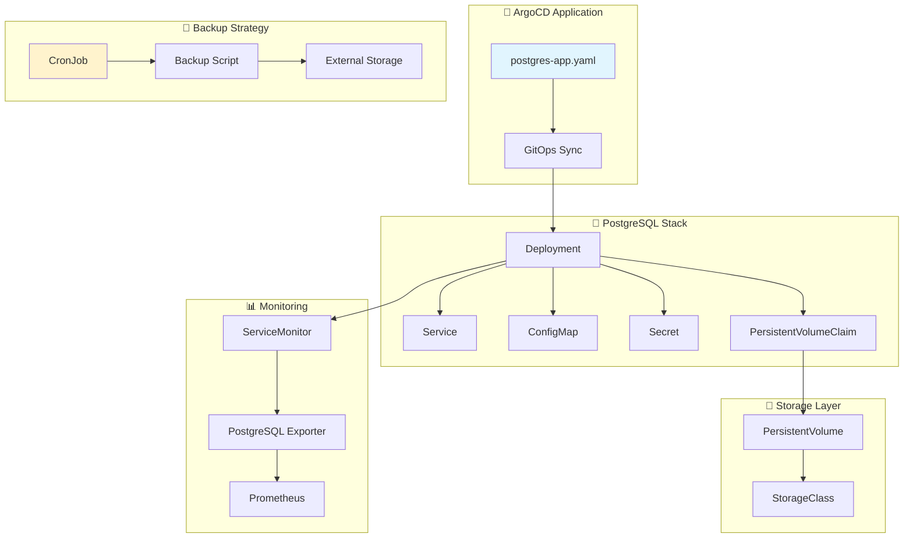
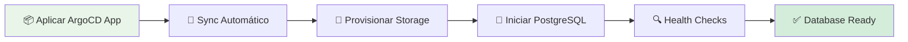
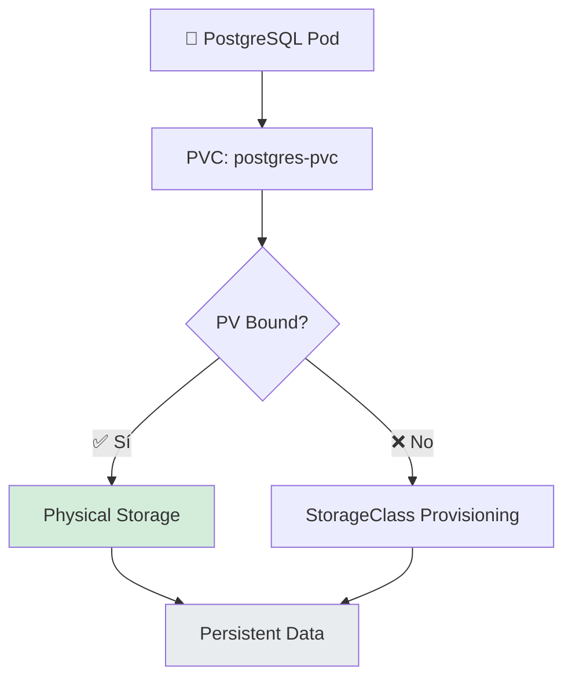
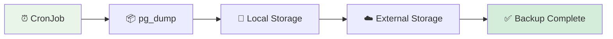
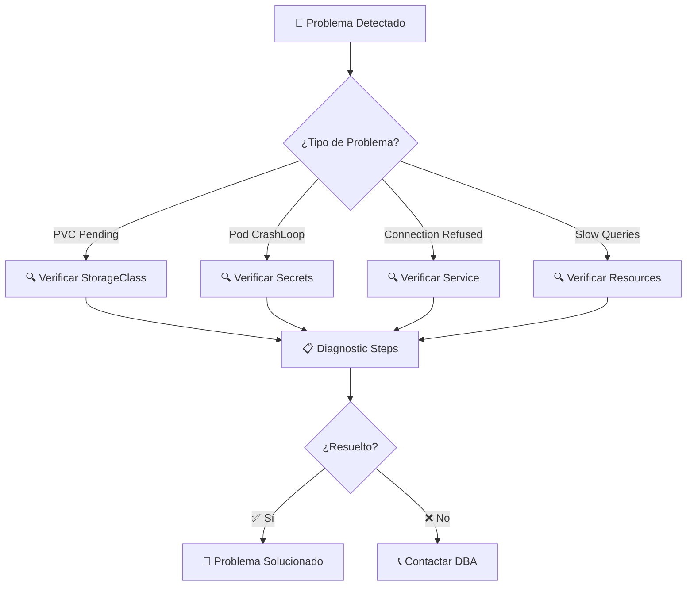

# 🐘 PostgreSQL Deployment - Base de Datos Backstage

[](https://postgresql.org/)
[](https://kubernetes.io/)
[](https://argo-cd.readthedocs.io/)

> **Configuración completa** de PostgreSQL para Backstage con persistencia, backups y alta disponibilidad en Kubernetes.

## 📋 Descripción General

Esta carpeta contiene todos los **manifiestos de Kubernetes** para desplegar PostgreSQL como base de datos principal de Backstage. Incluye configuración de persistencia, backups, monitoreo y optimizaciones para entornos de producción.

### ✨ Características Principales

- 💾 **Persistencia Robusta**: PV/PVC dedicados con StorageClass
- 🔄 **Backup/Restore**: Estrategias automatizadas de respaldo
- 📊 **Monitoreo Integrado**: Métricas y alertas configuradas
- 🔒 **Seguridad**: Credenciales en secrets y RBAC
- 📈 **Alta Disponibilidad**: Preparado para replicas

## 🏗️ Arquitectura de Base de Datos



## 📂 Estructura de Manifiestos

```
📁 postgres/
├── 📋 postgres-app.yaml            # 🎯 ArgoCD Application definition
├── 🚀 deploy-postgres.yaml         # 🚀 PostgreSQL deployment
├── 🌐 service-postgres.yaml        # 🌐 ClusterIP service (port 5432)
├── 💽 pv.yaml                      # 💽 PersistentVolume definition
├── 📦 pvc.yaml                     # 📦 PersistentVolumeClaim
├── 🔐 secret-postgres.yaml         # 🔐 Database credentials
├── ⚙️ configmap-postgres.yaml      # ⚙️ PostgreSQL configuration
├── 📊 servicemonitor.yaml          # 📊 Prometheus metrics collection
├── 🔄 cronjob-backup.yaml          # 🔄 Automated backup job
└── 📋 README.md                    # 📖 This documentation
```

## 🚀 Guía de Despliegue

### ⚡ Despliegue Automático (GitOps)



#### 🛠️ Comandos de Despliegue

```bash
# Despliegue vía ArgoCD (recomendado)
kubectl apply -f postgres-app.yaml

# Verificación del despliegue
kubectl get pods -l app=postgres -n backstage-manual
kubectl get pvc -n backstage-manual
kubectl logs -f deployment/postgres -n backstage-manual
```

### 📊 Verificación de Funcionamiento

```bash
# Ver estado del deployment
kubectl get deployment postgres -n backstage-manual

# Ver persistencia
kubectl get pvc postgres-pvc -n backstage-manual

# Probar conectividad
kubectl exec -it deployment/postgres -n backstage-manual -- psql -U backstage -d backstage -c "SELECT version();"
```

## ⚙️ Configuración de Base de Datos

### 🔧 Variables de Entorno Críticas

| Variable | Descripción | Valor por Defecto | Requerido |
|----------|-------------|-------------------|-----------|
| `POSTGRES_DB` | Nombre de la base de datos | `backstage` | ✅ |
| `POSTGRES_USER` | Usuario administrador | `backstage` | ✅ |
| `POSTGRES_PASSWORD` | Contraseña del usuario | - | ✅ |
| `PGDATA` | Directorio de datos | `/var/lib/postgresql/data` | ❌ |
| `POSTGRES_INITDB_ARGS` | Args de inicialización | - | ❌ |

### 📊 Recursos y Límites

```yaml
resources:
  requests:
    memory: "256Mi"
    cpu: "100m"
  limits:
    memory: "512Mi"
    cpu: "500m"

# Configuración de storage
storage:
  size: "10Gi"
  className: "manual"
  accessMode: "ReadWriteOnce"
```

## 💾 Persistencia y Storage

### 🏗️ Arquitectura de Almacenamiento



#### 📝 Configuración de PV/PVC

```yaml
# PersistentVolume
apiVersion: v1
kind: PersistentVolume
metadata:
  name: postgres-pv
spec:
  capacity:
    storage: 10Gi
  accessModes:
    - ReadWriteOnce
  persistentVolumeReclaimPolicy: Retain
  storageClassName: manual
  hostPath:
    path: "/data/postgres"

---
# PersistentVolumeClaim
apiVersion: v1
kind: PersistentVolumeClaim
metadata:
  name: postgres-pvc
spec:
  accessModes:
    - ReadWriteOnce
  resources:
    requests:
      storage: 10Gi
  storageClassName: manual
```

## 🔄 Estrategias de Backup y Restore

### 📦 Backup Automatizado



#### 🛠️ Scripts de Backup

```bash
# Backup manual
kubectl exec -n backstage-manual deployment/postgres -- \
  pg_dump -U backstage backstage > backup_$(date +%Y%m%d_%H%M%S).sql

# Restore manual
kubectl exec -n backstage-manual deployment/postgres -- \
  psql -U backstage backstage < backup_file.sql
```

#### 🔄 CronJob para Backups Automáticos

```yaml
apiVersion: batch/v1
kind: CronJob
metadata:
  name: postgres-backup
spec:
  schedule: "0 2 * * *"  # Daily at 2 AM
  jobTemplate:
    spec:
      template:
        spec:
          containers:
          - name: postgres-backup
            image: postgres:15
            command:
            - /bin/bash
            - -c
            - |
              pg_dump -h postgres -U backstage backstage > /backup/backup_$(date +%Y%m%d_%H%M%S).sql
          restartPolicy: OnFailure
```

## 📊 Monitoreo y Observabilidad

### 📈 Métricas de PostgreSQL

```yaml
# ServiceMonitor para Prometheus
apiVersion: monitoring.coreos.com/v1
kind: ServiceMonitor
metadata:
  name: postgres-servicemonitor
spec:
  selector:
    matchLabels:
      app: postgres
  endpoints:
  - port: metrics
    path: /metrics
    interval: 30s
```

#### 📊 Métricas Principales

- **Conexiones activas**: `pg_stat_activity`
- **Uso de tablas**: `pg_stat_user_tables`
- **Performance de queries**: `pg_stat_statements`
- **Uso de storage**: `pg_database_size`

### 🚨 Alertas Recomendadas

```yaml
# PrometheusRule para PostgreSQL
apiVersion: monitoring.coreos.com/v1
kind: PrometheusRule
metadata:
  name: postgres-alerts
spec:
  groups:
  - name: postgres
    rules:
    - alert: PostgreSQLDown
      expr: pg_up == 0
      for: 5m
      labels:
        severity: critical
      annotations:
        summary: "PostgreSQL is down"
```

## 🆘 Troubleshooting Avanzado

### 🔍 Diagnóstico Sistemático



### 🛠️ Comandos de Diagnóstico

```bash
# Ver estado del PVC
kubectl describe pvc postgres-pvc -n backstage-manual

# Ver logs detallados
kubectl logs -f deployment/postgres -n backstage-manual --previous

# Verificar conectividad interna
kubectl exec -it deployment/postgres -n backstage-manual -- psql -U backstage -d backstage -c "\l"

# Ver métricas de recursos
kubectl top pods -l app=postgres -n backstage-manual

# Ver configuración de secrets
kubectl describe secret postgres-secrets -n backstage-manual
```

### 🔧 Soluciones Comunes

| 🚨 Problema | 🔍 Diagnóstico | ✅ Solución |
|-------------|----------------|-------------|
| `PVC Pending` | `kubectl describe pvc` | Verificar StorageClass y nodos |
| `CrashLoopBackOff` | `kubectl logs` | Verificar credenciales y permisos |
| `Connection refused` | `kubectl get endpoints` | Verificar service selector |
| `Out of memory` | `kubectl top` | Aumentar límites de memoria |
| `Slow performance` | `pg_stat_statements` | Optimizar queries y índices |

## 🔒 Seguridad y Mejores Prácticas

### 🛡️ Configuración de Seguridad

- 🔐 **Credenciales en Secrets**: Nunca en manifiestos
- 👤 **Usuario no-root**: Contenedor ejecutándose como postgres
- 🔒 **Network Policies**: Restricción de tráfico
- 📊 **Auditoría**: Logs de conexiones activados

### 📈 Optimizaciones de Performance

```sql
-- Configuraciones recomendadas en postgresql.conf
shared_buffers = 256MB
effective_cache_size = 1GB
maintenance_work_mem = 64MB
checkpoint_completion_target = 0.9
wal_buffers = 16MB
default_statistics_target = 100
```

## 🔮 Evolución y Escalabilidad

### 🚀 Próximas Mejoras

- [ ] 🔄 **High Availability**: PostgreSQL con replicas
- [ ] 📊 **Connection Pooling**: PgBouncer integration
- [ ] 🔄 **Automated Failover**: Patroni operator
- [ ] ☁️ **Cloud Native**: CloudSQL o RDS migration
- [ ] 📈 **Auto-scaling**: Storage dinámico

### 🛠️ Mejoras Técnicas

- [ ] 💾 **Point-in-time Recovery**: WAL archiving
- [ ] 📊 **Advanced Monitoring**: pg_stat_statements
- [ ] 🔍 **Query Optimization**: Índices automáticos
- [ ] 📈 **Performance Tuning**: Configuración automática
- [ ] 🏗️ **Multi-database**: Separación por entornos

## 📞 Soporte y Referencias

### 🆘 Canales de Ayuda

- 📧 **Email**: jaimehenao8126@outlook.com
- 🐛 **Issues**: [GitHub Issues](https://github.com/Portfolio-jaime/Backstage-Manual/issues)
- 📖 **PostgreSQL Docs**: [postgresql.org/docs](https://www.postgresql.org/docs/)
- ☸️ **Kubernetes Docs**: [kubernetes.io/docs](https://kubernetes.io/docs/concepts/storage/)

### 📚 Documentación Relacionada

- [`../README.md`](../README.md) - Documentación principal del proyecto
- [`../backstage/README.md`](../backstage/README.md) - Configuración de Backstage
- [`../monitoring/README.md`](../monitoring/README.md) - Stack de monitoreo

---

<div align="center">

**🐘 Desarrollado con ❤️ para bases de datos PostgreSQL enterprise**

*¡La confiabilidad de los datos es nuestra prioridad máxima!*

</div>
