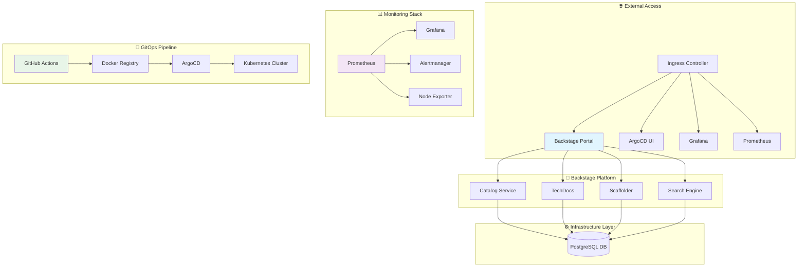
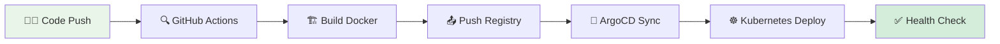
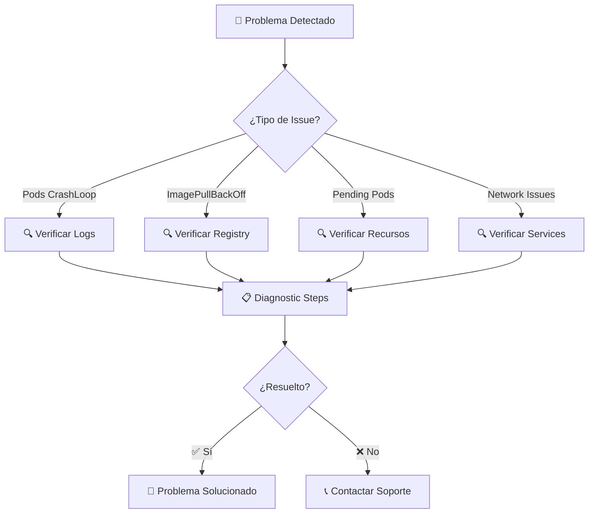
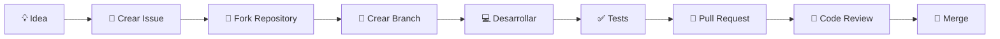

# 🚀 Backstage Solutions - Internal Developer Platform

[](https://kubernetes.io/)
[](https://docker.com/)
[](https://backstage.io/)
[](https://argo-cd.readthedocs.io/)
[](https://postgresql.org/)

> Una solución completa de **Internal Developer Platform (IDP)** basada en Backstage, containerizada y lista para desplegar en Kubernetes con monitoreo integrado.

## 📋 Descripción General

Este proyecto proporciona una implementación **enterprise-ready** de Backstage, el portal de desarrolladores de código abierto creado por Spotify. Incluye configuración completa para desarrollo local, containerización con Docker, despliegue en Kubernetes con GitOps, pipeline de CI/CD automatizado y stack de monitoreo completo.

### ✨ Características Principales

- 🎯 **Portal Unificado**: Catálogo centralizado de servicios, APIs y componentes
- 🔧 **Herramientas Integradas**: CI/CD, monitoreo y gestión de infraestructura
- 📊 **Observabilidad**: Prometheus + Grafana para métricas y dashboards
- 🔒 **Seguridad**: Secrets management y mejores prácticas implementadas
- 🚀 **GitOps**: Despliegue automatizado con ArgoCD
- 📚 **Documentación**: Portal técnico integrado con TechDocs

## 🏗️ Arquitectura del Sistema



## 📂 Estructura del Proyecto

```
📁 Backstage-solutions/
├── 🎨 IDP/                          # 🏠 Aplicación Backstage principal
│   ├── 📦 packages/                 # 💻 Código fuente (frontend/backend)
│   ├── 🔌 plugins/                  # 🧩 Plugins personalizados
│   ├── 📋 examples/                 # 📖 Ejemplos de entidades
│   ├── ⚙️ app-config*.yaml          # 🔧 Configuraciones
│   └── 🐳 Dockerfile                # 📦 Containerización
├── ☸️ Manifest/                     # 📋 Manifiestos de Kubernetes
│   ├── 🎭 backstage/               # 🎪 Recursos Backstage y ArgoCD
│   ├── 🐘 postgres/                # 💾 Recursos PostgreSQL
│   ├── 📊 monitoring/              # 📈 Prometheus y Grafana
│   ├── 🏷️ ns.yaml                  # 🏷️ Namespace
│   └── 💽 storageclass-manual.yaml # 💽 StorageClass
├── 🛠️ Scripts/                      # 🔧 Utilidades de desarrollo
│   ├── 🔄 switch_git_profile.py    # 👤 Gestión de perfiles Git
│   └── 📚 README.md                # 📖 Documentación de scripts
├── ⚙️ .github/                      # 🚀 CI/CD Pipeline
│   ├── 🔄 workflows/               # 🤖 GitHub Actions
│   └── 📚 README.md                # 📖 Documentación CI/CD
└── 📖 README.md                     # 📋 Esta documentación
```

## 🚀 Guías de Inicio Rápido

### ⚡ Despliegue Express (5 minutos)

```bash
# 1. Preparar entorno
kubectl create namespace backstage

# 2. Aplicar configuración base
kubectl apply -f Manifest/ns.yaml
kubectl apply -f Manifest/storageclass-manual.yaml

# 3. Desplegar componentes
kubectl apply -f Manifest/postgres/
kubectl apply -f Manifest/backstage/
kubectl apply -f Manifest/monitoring/

# 4. Verificar despliegue
kubectl get pods -n backstage
```

### 🧪 Desarrollo Local

```bash
# Instalar dependencias
cd IDP && yarn install

# Iniciar servidor de desarrollo
yarn start

# Acceder: http://localhost:3000
```

### 🔄 Pipeline CI/CD



## 📊 Servicios y Endpoints

| Servicio | URL | Estado | Descripción |
|----------|-----|--------|-------------|
| 🎭 **Backstage** | `http://backstage.local` | 🟢 Activo | Portal principal de desarrolladores |
| 🎪 **ArgoCD** | `http://argocd.local` | 🟢 Activo | Gestión GitOps |
| 📊 **Grafana** | `http://grafana.local` | 🟢 Activo | Dashboards de monitoreo |
| 📈 **Prometheus** | `http://prometheus.local` | 🟢 Activo | Métricas y alertas |
| 🐘 **PostgreSQL** | `postgres.backstage.svc` | 🟢 Activo | Base de datos |

### 🔧 Configuración y Personalización

### ⚙️ Variables de Entorno Críticas

```yaml
# Backstage Configuration (uso moderno de auth.keys)
BACKEND_AUTH_KEYS_0_SECRET: "<random-rotatable-64-byte-secret>"
POSTGRES_HOST: "postgres.backstage.svc.cluster.local"
POSTGRES_USER: "backstage"
POSTGRES_PASSWORD: "secure-password"

# GitHub OAuth (login)
GITHUB_CLIENT_ID: "<oauth-client-id>"
GITHUB_CLIENT_SECRET: "<oauth-client-secret>"

# Monitoring
GRAFANA_ADMIN_PASSWORD: "admin-password"
PROMETHEUS_RETENTION: "30d"
```

> Nota: Se eliminó el uso de `BACKEND_AUTH_SECRET` (deprecated). Ahora se utiliza `backend.auth.keys` con una lista de llaves que pueden rotarse sin invalidar inmediatamente sesiones previas (multi‑key support si se agregan más entradas). Rotar usando script custom (ver Scripts/rotate).

### 🔒 Seguridad Implementada

- ✅ **Secrets Management**: No hardcoded credentials
- ✅ **Network Policies**: Isolación de tráfico
- ✅ **RBAC**: Control de acceso granular
- ✅ **Image Security**: Scans automáticos
- ✅ **HTTPS Ready**: Configuración SSL preparada

### 🔍 Detalles recientes de monitoreo y seguridad

| Recurso | Archivo | Propósito |
|---------|---------|-----------|
| ServiceMonitor Backstage | `Manifest/backstage/service-monitor-backstage.yaml` | Scrapea métricas del backend en `:7007/metrics` |
| Alertmanager Config | `Manifest/monitoring/values.yaml` | Ruta y receiver inicial `dev-null` para validar alertas |
| NetworkPolicy Backstage | `Manifest/backstage/networkpolicy-backstage.yaml` | Restringe ingreso a Prometheus y Ingress NGINX |
| Trivy Scan CI | `.github/workflows/docker-image.yml` | Falla build si hay vulnerabilidades HIGH/CRITICAL |
| Cache mounts Yarn | `IDP/Dockerfile` | Acelera instalaciones y builds repetidos |

#### Cómo extender Alertmanager
Edita la sección `alertmanager.config.receivers` en `values.yaml` para añadir integraciones (email, Slack, PagerDuty). Después ejecuta `argocd app sync kube-prometheus-stack` o espera al auto-sync.

#### Recomendaciones siguientes
### 🛠️ Monitoreo: Fix de CRDs Prometheus (ArgoCD)

Durante la instalación del chart `kube-prometheus-stack` algunos **CustomResourceDefinitions (CRDs)** grandes (ej: `prometheuses.monitoring.coreos.com`, `thanosrulers.monitoring.coreos.com`, etc.) producían errores de sincronización en ArgoCD:

```
metadata.annotations: Too long: may not be more than 262144 bytes
```

**Causa raíz**:
- ArgoCD intentaba aplicar un patch *client-side apply* que genera / actualiza la annotation `kubectl.kubernetes.io/last-applied-configuration` con el manifiesto completo embebido.
- En CRDs grandes ese valor excede el límite máximo de tamaño para annotations (256 KiB).

**Intentos previos (fallidos / subóptimos)**:
- Eliminar manualmente annotations grandes (solo resuelve temporalmente; futuras reconciliaciones vuelven a intentar escribir el blob).
- Usar `Replace=true` (forzaba reemplazos completos del recurso, más agresivo y con riesgo de perder campos agregados por otros controladores).

**Solución implementada**:
1. Añadir `ignoreDifferences` en la ArgoCD Application apuntando a los seis CRDs problemáticos para ignorar diffs en `/metadata/annotations`.
2. Cambiar estrategia a `ServerSideApply=true` (usa *managedFields* en lugar de la annotation gigante).

**Razones para preferir ServerSideApply sobre Replace**:
- Evita el blob en `last-applied-configuration` → no supera límites.
- Conserva ownership granular de campos (managedFields) facilitando coexistencia con otros operadores.
- Reduce riesgo de "pisar" cambios externos.
- Mantiene actualizaciones incrementales y diffs más pequeños.

**Verificación**:
```bash
argocd app get kube-prometheus-stack | grep -E 'SyncFailed|Failed' || echo "Sin fallos"
```

**Checklist final aplicado**:
- [x] `ignoreDifferences` para `/metadata/annotations` en CRDs grandes.
- [x] `ServerSideApply=true` en `syncOptions`.
- [x] Eliminado `Replace=true` (ya no necesario).

> Si en el futuro aparece un nuevo CRD con el mismo síntoma, agregar entrada adicional a `ignoreDifferences` y verificar que SSA esté activo.

### 🔐 GitHub OAuth: Inyección de Credenciales en Kubernetes

Las credenciales OAuth (Client ID / Client Secret) **no** se versionan: el manifest `secret-backstage.yaml` mantiene placeholders. Para inyectarlas y reiniciar Backstage se utiliza el script:

`Scripts/update_github_oauth.sh`

**Uso básico**:
```bash
./Scripts/update_github_oauth.sh \
    -n backstage-manual \
    -c <GITHUB_CLIENT_ID> \
    -s <GITHUB_CLIENT_SECRET>
```

**Con rotación simultánea del auth key**:
```bash
./Scripts/update_github_oauth.sh \
    -n backstage-manual \
    -c <GITHUB_CLIENT_ID> \
    -s <GITHUB_CLIENT_SECRET> \
    --rotate-auth
```

El script:
- Crea el secreto si no existe (añadiendo una nueva key para `BACKEND_AUTH_KEYS_0_SECRET`).
- Parchea únicamente las claves indicadas (sin exponer valores en la salida estándar).
- Reinicia el Deployment y espera readiness.
- Muestra logs donde se inicializa el provider GitHub.

**Validaciones post inyección**:
```bash
curl -I https://backstage.local/api/auth/github/start   # Debe responder 302
kubectl -n backstage-manual logs -l app=backstage | grep -i 'Configuring auth provider: github' | tail
```

**Errores comunes**:
| Error | Causa | Solución |
|-------|-------|----------|
| 404 /api/auth/github/start | Provider ID incorrecto en frontend | Asegurar uso de `github` en el proveedor de `App.tsx` |
| redirect_uri mismatch | Callback distinta en OAuth App | Igualar exactamente `https://backstage.local/api/auth/github/handler/frame` |
| invalid_client | Client ID o Secret erróneos | Regenerar y re‑parchear secreto |
| Loop de login | Dominio/CORS desalineado | Revisar `backend.cors.origin` y `app.baseUrl` |

> Nota sobre `?env=production`: la versión actual de los paquetes de autenticación requiere especificar el entorno (`production`) porque la configuración del proveedor GitHub se declara bajo `auth.providers.github.production`. El flujo normal de la UI ya añade `?env=production` automáticamente. Los intentos de aplanar la configuración (mover `clientId` directamente bajo `github:`) generan errores de esquema en esta versión. Para eliminar el parámetro en el futuro será necesario actualizar Backstage a una versión que soporte configuración plana o crear un wrapper que llame internamente al endpoint con el parámetro.

**Rotación periódica recomendada**: usar `--rotate-auth` cada cierto tiempo (ej. mensual) y mantener versión previa (añadiendo llaves adicionales) si se desea evitar invalidar sesiones activas.

> Separar OAuth (login de usuarios) de PATs usados por el scaffolder/catalogo. PATs nunca deben exponerse en repositorios públicos.
- Firmar la imagen con `cosign` y habilitar verificación en admisión.
- Añadir dashboards específicos de Backstage (latencia API, duración scaffolder).
- Definir SLOs y alertas de error rate y p95 latency.
- Activar métricas de plugins personalizados.

## � Autenticación GitHub (OAuth + Integraciones)

Esta sección explica cómo habilitar y migrar la autenticación GitHub desde un entorno local (`localhost`) hacia un dominio interno (`https://backstage.local`). Incluye también la diferencia entre **OAuth App** y **Personal Access Token (PAT)** usados por el catálogo y el scaffolder.

### 🧩 Componentes Involucrados

- `auth.providers.github` (OAuth) en `app-config.yaml` / `app-config.production.yaml`
- Variables de entorno: `GITHUB_CLIENT_ID`, `GITHUB_CLIENT_SECRET`
- `integrations.github[].token` (PAT con scopes de lectura para catálogo y templates)
- Ingress / DNS apuntando a `backstage.local`

### 🛠️ Pasos Local (localhost)

1. Crear OAuth App en GitHub: Settings > Developer settings > OAuth Apps > New OAuth App.
2. Nombre: `Backstage Local`
3. Homepage URL: `http://localhost:3000` (frontend de Backstage)
4. Authorization callback URL: `http://localhost:7007/api/auth/github/handler/frame`
5. Guardar y copiar `Client ID` y generar `Client Secret`.
6. Añadirlos a tu entorno local (export o docker run):

```bash
export GITHUB_CLIENT_ID="<client-id>"
export GITHUB_CLIENT_SECRET="<client-secret>"
docker run --rm -p 7007:7007 \
    -e GITHUB_CLIENT_ID -e GITHUB_CLIENT_SECRET \
    backstage-local:dev
```

### 🚀 Migración a Dominio Interno (`https://backstage.local`)

Cuando definas el Ingress y DNS para `backstage.local`:

| Elemento | Valor Local | Valor Producción |
|----------|-------------|------------------|
| `app.baseUrl` | `http://localhost:3000` | `https://backstage.local` |
| `backend.baseUrl` | `http://localhost:7007` | `https://backstage.local` |
| Callback OAuth | `http://localhost:7007/api/auth/github/handler/frame` | `https://backstage.local/api/auth/github/handler/frame` |
| Homepage OAuth | `http://localhost:3000` | `https://backstage.local` |

Pasos:
1. Crear NUEVA OAuth App (recomendado) llamada `Backstage` para producción.
2. Usar la callback de producción exacta (HTTPS + dominio correcto).
3. Actualizar `app-config.production.yaml` con los nuevos `baseUrl`.
4. Actualizar Ingress host (`backstage.local`).
5. Emitir/rotar `Client Secret` y actualizar `secret-backstage.yaml` (`stringData`).
6. Rebuild + redeploy (`docker build` + push + ArgoCD sync).

### 🧪 Verificación Rápida

```bash
# Ver que el backend expone el inicio OAuth
curl -I https://backstage.local/api/auth/github/start  # Debe responder 302

# Local (si sigues en dev)
curl -I http://localhost:7007/api/auth/github/start
```

### 🎯 Scopes Recomendados

Para la OAuth App de login: normalmente sin scopes especiales (GitHub devuelve email básico). Si necesitas datos privados de repos:

- `read:user` (implícito)
- `user:email`
- Añadir `repo` SOLO si vas a listar repos privados en plugins.

Para el PAT (`integrations.github.token`): mínimo `repo:read` si lees repos privados. Evita scopes de escritura a menos que el scaffolder necesite crear repos (`repo` + `workflow` si dispara GitHub Actions).

### 🧪 Flujo de Login (Interno)

1. Usuario abre Backstage y selecciona proveedor GitHub.
2. Backend redirige a GitHub (`/api/auth/github/start`).
3. GitHub valida `redirect_uri` exacto.
4. Backend procesa el código y genera sesión.
5. Frontend establece cookies / sesión y redirige a la app.

### ⚠️ Errores Comunes

| Error | Causa | Solución |
|-------|-------|----------|
| 404 `/api/auth/github/start` | ID proveedor incorrecto (`github-auth`) | Usar `id: 'github'` en `App.tsx` |
| `redirect_uri mismatch` | Callback diferente a la registrada | Verificar HTTPS, dominio y ruta `/api/auth/github/handler/frame` |
| `invalid_client` | Client ID/Secret erróneos | Regenerar secret y actualizar deployment / secret K8s |
| Loop login | Cookies bloqueadas / CORS | Revisar `backend.cors.origin` y dominios permitidos |

### 🔄 Cambio de Local a Producción sin Downtime

Estrategia recomendada:
1. Crear OAuth App producción y validar en ambiente staging (`backstage-staging.local`).
2. Añadir ambas configuraciones (`development` + `production`) temporalmente si separas entornos.
3. Activar Ingress nuevo y verificar health antes de switch DNS final.
4. Rotar secret antiguo tras confirmación.

### 🧰 Checklist Final Producción

- [ ] DNS / Ingress resolviendo `https://backstage.local`
- [ ] Certificado TLS válido (Let's Encrypt interno o corporativo)
- [ ] `app-config.production.yaml` con baseUrl actualizado
- [ ] Secret K8s contiene `GITHUB_CLIENT_ID` y `GITHUB_CLIENT_SECRET` reales
- [ ] Imagen reconstruida post-cambio
- [ ] ArgoCD sync OK y pods Healthy
- [ ] Login GitHub 302 → GitHub → 302 → Backstage (sin errores)

### 📌 Notas

- Mantén separado OAuth (login) de PAT (catalogo) para poder rotar tokens sin afectar sesiones.
- Usa `stringData` en secretos para facilitar cambios; Kubernetes los convierte a base64 automáticamente.
- No reutilices la misma OAuth App para entornos radicalmente distintos (riesgo de fugas en callback y problemas de auditoría).

Si deseas, puedo aplicar directamente los cambios de `app-config.production.yaml` para el dominio definitivo una vez confirmes que el Ingress está listo.

## �📝 Roadmap y TODOs

### 🚀 Próximas Funcionalidades

- [ ] 🔐 **Autenticación Avanzada**: Integración con LDAP/OAuth
- [ ] 📊 **Dashboards Personalizados**: Métricas específicas de negocio
- [ ] 🚨 **Alertas Inteligentes**: Alertmanager con Slack/Email
- [ ] 🔄 **Auto-scaling**: HPA para componentes críticos
- [ ] 📚 **TechDocs Avanzado**: Generación automática de docs
- [ ] 🔍 **Search Mejorado**: Búsqueda semántica
- [ ] 📦 **Plugin Marketplace**: Catálogo de plugins internos

### 🛠️ Mejoras Técnicas

- [ ] 💾 **Backup Automático**: Estrategia de respaldo PostgreSQL
- [ ] 📈 **Performance Monitoring**: APM integrado
- [ ] 🔄 **Blue-Green Deployments**: Estrategia de despliegue
- [ ] 🏗️ **Multi-cluster**: Soporte para múltiples clusters
- [ ] 📊 **Cost Monitoring**: Análisis de costos por componente

## 🆘 Troubleshooting Avanzado



### � Nota de Consolidación ArgoCD
Mantén una sola instalación de ArgoCD en el namespace `argocd` para evitar reconciliaciones duplicadas y drift.
Diagnóstico rápido:
```bash
kubectl get deploy,svc,cm,secret -n default | grep -i argocd || true
```
Si aparecen recursos, sigue los pasos de limpieza en `Manifest/argocd/README.md` antes de aplicar nuevas Applications o App-of-Apps.

### �🔧 Comandos de Diagnóstico

```bash
# Ver estado general del cluster
kubectl get all -n backstage

# Ver logs de un pod específico
kubectl logs -f deployment/backstage -n backstage

# Ver eventos del namespace
kubectl get events -n backstage --sort-by=.metadata.creationTimestamp

# Ver métricas de recursos
kubectl top pods -n backstage

# Ver configuración de ingress
kubectl describe ingress -n backstage
```

## 🤝 Contribución y Desarrollo

### 📋 Proceso de Contribución



### 🛠️ Configuración de Desarrollo

1. **Clonar y configurar**:
   ```bash
   git clone https://github.com/Portfolio-jaime/Backstage-Manual.git
   cd Backstage-Manual
   python Scripts/switch_git_profile.py personal
   ```

2. **Instalar dependencias**:
   ```bash
   cd IDP
   yarn install
   ```

3. **Configurar entorno local**:
   ```bash
   cp app-config.yaml app-config.local.yaml
   # Editar configuraciones locales
   ```

## 📚 Documentación Adicional

| 📖 Documento | 🎯 Propósito | 📍 Ubicación |
|-------------|-------------|-------------|
| **🏠 Arquitectura IDP** | Detalles técnicos de Backstage | [`IDP/README.md`](IDP/README.md) |
| **☸️ Kubernetes Manifests** | Guías de despliegue K8s | [`Manifest/README.md`](Manifest/README.md) |
| **🎭 Backstage Deployment** | Configuración específica | [`Manifest/backstage/README.md`](Manifest/backstage/README.md) |
| **🐘 PostgreSQL Setup** | Base de datos y persistencia | [`Manifest/postgres/README.md`](Manifest/postgres/README.md) |
| **📊 Monitoring Stack** | Prometheus y Grafana | [`Manifest/monitoring/README.md`](Manifest/monitoring/README.md) |
| **🛠️ Scripts Utilitarios** | Herramientas de desarrollo | [`Scripts/README.md`](Scripts/README.md) |
| **⚙️ CI/CD Pipeline** | Automatización de despliegue | [`.github/README.md`](.github/README.md) |

## 🏆 Mejores Prácticas Globales

### 🔒 Seguridad
- 🔐 Rotar secrets periódicamente
- 🛡️ Implementar principle of least privilege
- 📊 Monitorear accesos y cambios
- 🔄 Actualizar dependencias regularmente

### 🚀 Performance
- 📈 Configurar límites de recursos apropiados
- 🔄 Implementar cache donde sea necesario
- 📊 Monitorear métricas de rendimiento
- 🔧 Optimizar queries de base de datos

### 📊 Observabilidad
- 📈 Definir SLOs y SLIs claros
- 🚨 Configurar alertas proactivas
- 📋 Mantener runbooks actualizados
- 🔍 Implementar logging estructurado

## 📞 Soporte y Contacto

### 🆘 Canales de Soporte

- 📧 **Email**: jaimehenao8126@outlook.com
- 🐛 **Issues**: [GitHub Issues](https://github.com/Portfolio-jaime/Backstage-Manual/issues)
- 📖 **Documentación**: [Backstage Official](https://backstage.io/docs)
- 💬 **Discusiones**: [GitHub Discussions](https://github.com/Portfolio-jaime/Backstage-Manual/discussions)

### 👥 Comunidad

- 🌟 **Contribuciones**: ¡Todas son bienvenidas!
- 📚 **Documentación**: Mejoras constantes
- 🤝 **Colaboración**: Ambiente abierto y constructivo

---

<div align="center">

**Desarrollado con ❤️ por [Jaime Henao](https://github.com/Portfolio-jaime)**

[](https://github.com/Portfolio-jaime)
[](https://linkedin.com/in/jaimehenao)
[](https://portfolio-jaime.github.io)

*⭐ Si este proyecto te resulta útil, ¡dale una estrella en GitHub!*

</div>