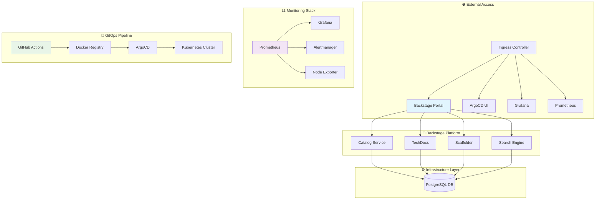
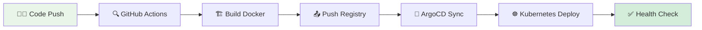
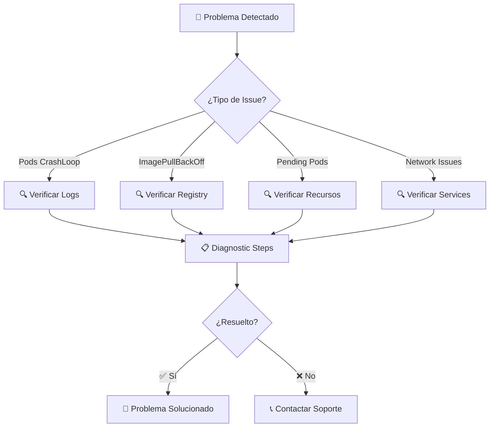
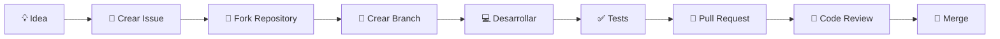

# 🚀 Backstage Solutions - Internal Developer Platform

[](https://kubernetes.io/)
[](https://docker.com/)
[](https://backstage.io/)
[](https://argo-cd.readthedocs.io/)
[](https://postgresql.org/)

> Una solución completa de **Internal Developer Platform (IDP)** basada en Backstage, containerizada y lista para desplegar en Kubernetes con monitoreo integrado.

## 📋 Descripción General

Este proyecto proporciona una implementación **enterprise-ready** de Backstage, el portal de desarrolladores de código abierto creado por Spotify. Incluye configuración completa para desarrollo local, containerización con Docker, despliegue en Kubernetes con GitOps, pipeline de CI/CD automatizado y stack de monitoreo completo.

### ✨ Características Principales

- 🎯 **Portal Unificado**: Catálogo centralizado de servicios, APIs y componentes
- 🔧 **Herramientas Integradas**: CI/CD, monitoreo y gestión de infraestructura
- 📊 **Observabilidad**: Prometheus + Grafana para métricas y dashboards
- 🔒 **Seguridad**: Secrets management y mejores prácticas implementadas
- 🚀 **GitOps**: Despliegue automatizado con ArgoCD
- 📚 **Documentación**: Portal técnico integrado con TechDocs

## 🏗️ Arquitectura del Sistema



## 📂 Estructura del Proyecto

```
📁 Backstage-solutions/
├── 🎨 IDP/                          # 🏠 Aplicación Backstage principal
│   ├── 📦 packages/                 # 💻 Código fuente (frontend/backend)
│   ├── 🔌 plugins/                  # 🧩 Plugins personalizados
│   ├── 📋 examples/                 # 📖 Ejemplos de entidades
│   ├── ⚙️ app-config*.yaml          # 🔧 Configuraciones
│   └── 🐳 Dockerfile                # 📦 Containerización
├── ☸️ Manifest/                     # 📋 Manifiestos de Kubernetes
│   ├── 🎭 backstage/               # 🎪 Recursos Backstage y ArgoCD
│   ├── 🐘 postgres/                # 💾 Recursos PostgreSQL
│   ├── 📊 monitoring/              # 📈 Prometheus y Grafana
│   ├── 🏷️ ns.yaml                  # 🏷️ Namespace
│   └── 💽 storageclass-manual.yaml # 💽 StorageClass
├── 🛠️ Scripts/                      # 🔧 Utilidades de desarrollo
│   ├── 🔄 switch_git_profile.py    # 👤 Gestión de perfiles Git
│   └── 📚 README.md                # 📖 Documentación de scripts
├── ⚙️ .github/                      # 🚀 CI/CD Pipeline
│   ├── 🔄 workflows/               # 🤖 GitHub Actions
│   └── 📚 README.md                # 📖 Documentación CI/CD
└── 📖 README.md                     # 📋 Esta documentación
```

## 🚀 Guías de Inicio Rápido

### ⚡ Despliegue Express (5 minutos)

```bash
# 1. Preparar entorno
kubectl create namespace backstage

# 2. Aplicar configuración base
kubectl apply -f Manifest/ns.yaml
kubectl apply -f Manifest/storageclass-manual.yaml

# 3. Desplegar componentes
kubectl apply -f Manifest/postgres/
kubectl apply -f Manifest/backstage/
kubectl apply -f Manifest/monitoring/

# 4. Verificar despliegue
kubectl get pods -n backstage
```

### 🧪 Desarrollo Local

```bash
# Instalar dependencias
cd IDP && yarn install

# Iniciar servidor de desarrollo
yarn start

# Acceder: http://localhost:3000
```

### 🔄 Pipeline CI/CD



## 📊 Servicios y Endpoints

| Servicio | URL | Estado | Descripción |
|----------|-----|--------|-------------|
| 🎭 **Backstage** | `http://backstage.local` | 🟢 Activo | Portal principal de desarrolladores |
| 🎪 **ArgoCD** | `http://argocd.local` | 🟢 Activo | Gestión GitOps |
| 📊 **Grafana** | `http://grafana.local` | 🟢 Activo | Dashboards de monitoreo |
| 📈 **Prometheus** | `http://prometheus.local` | 🟢 Activo | Métricas y alertas |
| 🐘 **PostgreSQL** | `postgres.backstage.svc` | 🟢 Activo | Base de datos |

## 🔧 Configuración y Personalización

### ⚙️ Variables de Entorno Críticas

```yaml
# Backstage Configuration
BACKEND_AUTH_SECRET: "your-secret-key"
POSTGRES_HOST: "postgres.backstage.svc.cluster.local"
POSTGRES_USER: "backstage"
POSTGRES_PASSWORD: "secure-password"

# Monitoring
GRAFANA_ADMIN_PASSWORD: "admin-password"
PROMETHEUS_RETENTION: "30d"
```

### 🔒 Seguridad Implementada

- ✅ **Secrets Management**: No hardcoded credentials
- ✅ **Network Policies**: Isolación de tráfico
- ✅ **RBAC**: Control de acceso granular
- ✅ **Image Security**: Scans automáticos
- ✅ **HTTPS Ready**: Configuración SSL preparada

### 🔍 Detalles recientes de monitoreo y seguridad

| Recurso | Archivo | Propósito |
|---------|---------|-----------|
| ServiceMonitor Backstage | `Manifest/backstage/service-monitor-backstage.yaml` | Scrapea métricas del backend en `:7007/metrics` |
| Alertmanager Config | `Manifest/monitoring/values.yaml` | Ruta y receiver inicial `dev-null` para validar alertas |
| NetworkPolicy Backstage | `Manifest/backstage/networkpolicy-backstage.yaml` | Restringe ingreso a Prometheus y Ingress NGINX |
| Trivy Scan CI | `.github/workflows/docker-image.yml` | Falla build si hay vulnerabilidades HIGH/CRITICAL |
| Cache mounts Yarn | `IDP/Dockerfile` | Acelera instalaciones y builds repetidos |

#### Cómo extender Alertmanager
Edita la sección `alertmanager.config.receivers` en `values.yaml` para añadir integraciones (email, Slack, PagerDuty). Después ejecuta `argocd app sync kube-prometheus-stack` o espera al auto-sync.

#### Recomendaciones siguientes
- Firmar la imagen con `cosign` y habilitar verificación en admisión.
- Añadir dashboards específicos de Backstage (latencia API, duración scaffolder).
- Definir SLOs y alertas de error rate y p95 latency.
- Activar métricas de plugins personalizados.

## 📝 Roadmap y TODOs

### 🚀 Próximas Funcionalidades

- [ ] 🔐 **Autenticación Avanzada**: Integración con LDAP/OAuth
- [ ] 📊 **Dashboards Personalizados**: Métricas específicas de negocio
- [ ] 🚨 **Alertas Inteligentes**: Alertmanager con Slack/Email
- [ ] 🔄 **Auto-scaling**: HPA para componentes críticos
- [ ] 📚 **TechDocs Avanzado**: Generación automática de docs
- [ ] 🔍 **Search Mejorado**: Búsqueda semántica
- [ ] 📦 **Plugin Marketplace**: Catálogo de plugins internos

### 🛠️ Mejoras Técnicas

- [ ] 💾 **Backup Automático**: Estrategia de respaldo PostgreSQL
- [ ] 📈 **Performance Monitoring**: APM integrado
- [ ] 🔄 **Blue-Green Deployments**: Estrategia de despliegue
- [ ] 🏗️ **Multi-cluster**: Soporte para múltiples clusters
- [ ] 📊 **Cost Monitoring**: Análisis de costos por componente

## 🆘 Troubleshooting Avanzado



### 🔧 Comandos de Diagnóstico

```bash
# Ver estado general del cluster
kubectl get all -n backstage

# Ver logs de un pod específico
kubectl logs -f deployment/backstage -n backstage

# Ver eventos del namespace
kubectl get events -n backstage --sort-by=.metadata.creationTimestamp

# Ver métricas de recursos
kubectl top pods -n backstage

# Ver configuración de ingress
kubectl describe ingress -n backstage
```

## 🤝 Contribución y Desarrollo

### 📋 Proceso de Contribución



### 🛠️ Configuración de Desarrollo

1. **Clonar y configurar**:
   ```bash
   git clone https://github.com/Portfolio-jaime/Backstage-Manual.git
   cd Backstage-Manual
   python Scripts/switch_git_profile.py personal
   ```

2. **Instalar dependencias**:
   ```bash
   cd IDP
   yarn install
   ```

3. **Configurar entorno local**:
   ```bash
   cp app-config.yaml app-config.local.yaml
   # Editar configuraciones locales
   ```

## 📚 Documentación Adicional

| 📖 Documento | 🎯 Propósito | 📍 Ubicación |
|-------------|-------------|-------------|
| **🏠 Arquitectura IDP** | Detalles técnicos de Backstage | [`IDP/README.md`](IDP/README.md) |
| **☸️ Kubernetes Manifests** | Guías de despliegue K8s | [`Manifest/README.md`](Manifest/README.md) |
| **🎭 Backstage Deployment** | Configuración específica | [`Manifest/backstage/README.md`](Manifest/backstage/README.md) |
| **🐘 PostgreSQL Setup** | Base de datos y persistencia | [`Manifest/postgres/README.md`](Manifest/postgres/README.md) |
| **📊 Monitoring Stack** | Prometheus y Grafana | [`Manifest/monitoring/README.md`](Manifest/monitoring/README.md) |
| **🛠️ Scripts Utilitarios** | Herramientas de desarrollo | [`Scripts/README.md`](Scripts/README.md) |
| **⚙️ CI/CD Pipeline** | Automatización de despliegue | [`.github/README.md`](.github/README.md) |

## 🏆 Mejores Prácticas Globales

### 🔒 Seguridad
- 🔐 Rotar secrets periódicamente
- 🛡️ Implementar principle of least privilege
- 📊 Monitorear accesos y cambios
- 🔄 Actualizar dependencias regularmente

### 🚀 Performance
- 📈 Configurar límites de recursos apropiados
- 🔄 Implementar cache donde sea necesario
- 📊 Monitorear métricas de rendimiento
- 🔧 Optimizar queries de base de datos

### 📊 Observabilidad
- 📈 Definir SLOs y SLIs claros
- 🚨 Configurar alertas proactivas
- 📋 Mantener runbooks actualizados
- 🔍 Implementar logging estructurado

## 📞 Soporte y Contacto

### 🆘 Canales de Soporte

- 📧 **Email**: jaimehenao8126@outlook.com
- 🐛 **Issues**: [GitHub Issues](https://github.com/Portfolio-jaime/Backstage-Manual/issues)
- 📖 **Documentación**: [Backstage Official](https://backstage.io/docs)
- 💬 **Discusiones**: [GitHub Discussions](https://github.com/Portfolio-jaime/Backstage-Manual/discussions)

### 👥 Comunidad

- 🌟 **Contribuciones**: ¡Todas son bienvenidas!
- 📚 **Documentación**: Mejoras constantes
- 🤝 **Colaboración**: Ambiente abierto y constructivo

---

<div align="center">

**Desarrollado con ❤️ por [Jaime Henao](https://github.com/Portfolio-jaime)**

[](https://github.com/Portfolio-jaime)
[](https://linkedin.com/in/jaimehenao)
[](https://portfolio-jaime.github.io)

*⭐ Si este proyecto te resulta útil, ¡dale una estrella en GitHub!*

</div>