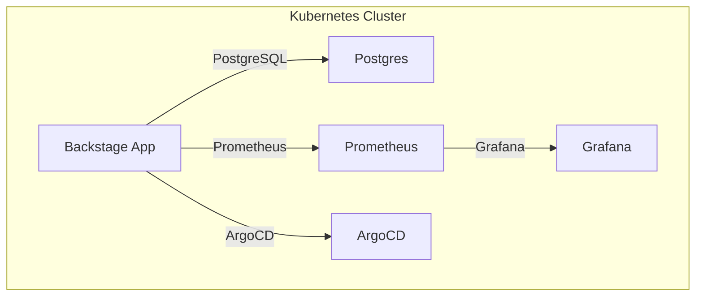

# Backstage Solutions - Manual de Despliegue

Una solución completa de Internal Developer Platform (IDP) basada en Backstage, containerizada y lista para desplegar en Kubernetes.

## 📋 Descripción General

Este proyecto proporciona una implementación completa de Backstage, el portal de desarrolladores de código abierto creado por Spotify. Incluye configuración para desarrollo local, containerización con Docker, despliegue en Kubernetes y pipeline de CI/CD automatizado.

## 🏗️ Arquitectura del Proyecto

```
Backstage-solutions/
├── IDP/                    # Aplicación Backstage principal
│   ├── packages/          # Código fuente (frontend/backend)
│   ├── plugins/           # Plugins personalizados
│   ├── examples/          # Ejemplos de entidades
│   └── app-config*.yaml   # Configuraciones
├── Manifest/              # Manifiestos de Kubernetes
│   ├── deploy-*.yaml      # Despliegues
│   ├── service-*.yaml     # Servicios
│   ├── secret-*.yaml      # Credenciales
│   └── ns.yaml           # Namespace
├── Scripts/              # Utilidades de desarrollo
│   └── switch_git_profile.py  # Gestión de perfiles Git
├── .github/              # CI/CD Pipeline
│   └── workflows/        # GitHub Actions
└── README.md            # Esta documentación
```

## 🚀 Inicio Rápido

### Despliegue en Kubernetes (Recomendado)


# Backstage Solutions - Plataforma IDP en Kubernetes

## 🏗️ Diagrama de Arquitectura



## 📂 Estructura del Proyecto

```
Backstage-solutions/
├── IDP/                    # Código fuente Backstage
├── Manifest/               # Manifiestos Kubernetes
│   ├── backstage/          # Recursos Backstage y ArgoCD
│   ├── postgres/           # Recursos PostgreSQL
│   ├── monitoring/         # Prometheus y Grafana
│   ├── ns.yaml             # Namespace
│   └── storageclass-manual.yaml # StorageClass
├── Scripts/                # Utilidades
└── README.md               # Documentación principal
```

## � Guía de Despliegue

### 1. Pre-requisitos
- Kubernetes (minikube/kind)
- kubectl
- Docker
- ArgoCD instalado

### 2. Despliegue de recursos
```bash
kubectl apply -f Manifest/ns.yaml
kubectl apply -f Manifest/storageclass-manual.yaml
kubectl apply -f Manifest/postgres/
kubectl apply -f Manifest/backstage/
kubectl apply -f Manifest/monitoring/
```

### 3. Acceso a servicios
- Backstage: http://backstage.local
- ArgoCD: http://argocd.local
- Prometheus: http://prometheus.local
- Grafana: http://grafana.local

### 4. Gestión con ArgoCD
- Apps separadas para Backstage y Postgres
- Sincroniza desde la UI de ArgoCD

## 📊 Monitoreo
- Prometheus recolecta métricas de recursos
- Grafana visualiza dashboards
- Acceso por Ingress configurado

## 🛠️ Desarrollo Local
```bash
cd IDP
yarn install
yarn start
```
Accede a http://localhost:3000

## 📝 TODO
- [ ] Añadir dashboards personalizados en Grafana
- [ ] Integrar alertas con Alertmanager
- [ ] Mejorar seguridad de secrets
- [ ] Automatizar despliegue con CI/CD
- [ ] Documentar integración de plugins Backstage

## 📚 Guías Rápidas
- Para crear una nueva app en ArgoCD, usa los manifiestos en `Manifest/backstage` y `Manifest/postgres`.
- Para monitoreo, revisa los manifiestos en `Manifest/monitoring`.
- Para restaurar la base de datos, usa los PVC y PV en `Manifest/postgres/pv.yaml`.

---
**Desarrollado con ❤️ por Jaime Henao**
# Ver eventos
kubectl get events -n backstage --sort-by=.metadata.creationTimestamp
```

### Problemas Comunes

1. **Pods en CrashLoopBackOff**
   - Verificar variables de entorno
   - Revisar conectividad a PostgreSQL

2. **ImagePullBackOff**
   - Verificar credenciales de Docker Hub
   - Confirmar que la imagen existe

3. **Pending Pods**
   - Verificar recursos disponibles en el clúster
   - Revisar configuración de PersistentVolume

## 🔒 Seguridad

### Mejores Prácticas Implementadas

- Secrets en Kubernetes (no hardcoded)
- Imágenes base actualizadas
- Usuario no-root en contenedores
- Políticas de red (NetworkPolicies recomendadas)

### Consideraciones Adicionales

- Cambiar contraseñas por defecto en producción
- Implementar HTTPS con certificados
- Configurar RBAC en Kubernetes
- Monitoreo de logs y métricas

## � Migración Reciente

Se migró el stack de monitoreo de manifiestos manuales a un chart Helm (`kube-prometheus-stack`) gestionado por ArgoCD, reduciendo complejidad y facilitando upgrades.

## 📚 Documentación por Carpeta

   - [`Manifest/backstage/README.md`](Manifest/backstage/README.md) – Detalles despliegue Backstage.
   - [`Manifest/postgres/README.md`](Manifest/postgres/README.md) – Base de datos y persistencia.
   - [`Manifest/monitoring/README.md`](Manifest/monitoring/README.md) – Helm chart de monitoreo.
 
## 🤝 Contribución

1. Fork el proyecto
2. Crea una rama para tu feature (`git checkout -b feature/AmazingFeature`)
3. Commit tus cambios (`git commit -m 'Add some AmazingFeature'`)
4. Push a la rama (`git push origin feature/AmazingFeature`)
5. Abre un Pull Request

## 📄 Licencia

Este proyecto está bajo la Licencia MIT. Ver el archivo `LICENSE` para más detalles.

## 🆘 Soporte

Para soporte técnico o preguntas:

- 📧 Email: jaimehenao8126@outlook.com
- 🐛 Issues: [GitHub Issues](https://github.com/Portfolio-jaime/Backstage-Manual/issues)
- 📖 Docs: [Backstage Official](https://backstage.io)

---

**Desarrollado con ❤️ por Jaime Henao**