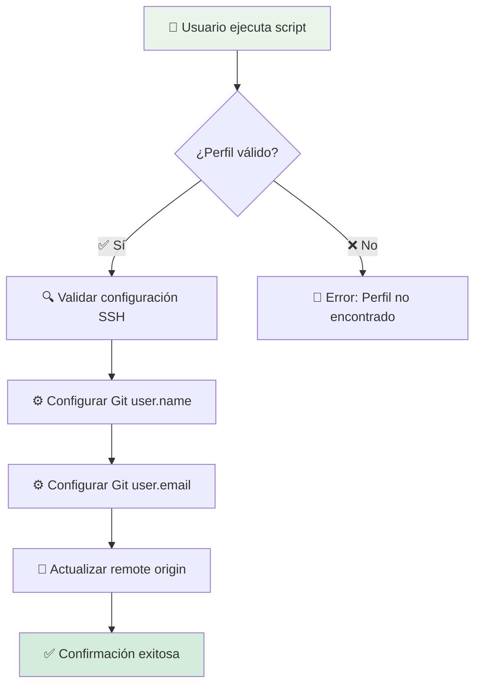
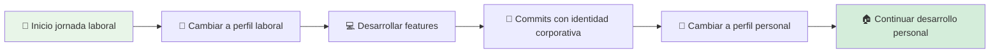
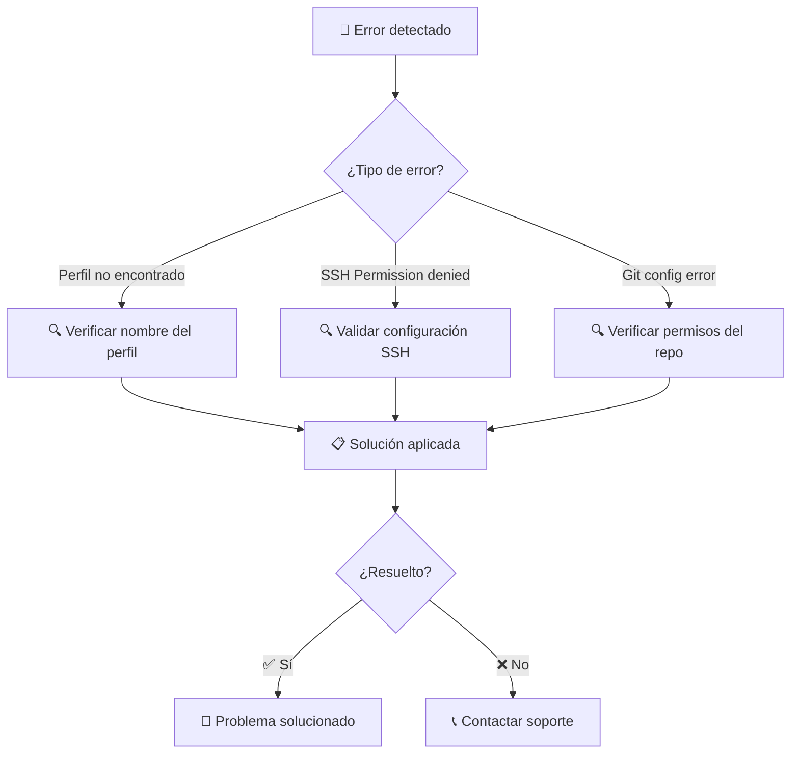

# 🛠️ Scripts de Utilidad - Automatización Backstage

[](https://python.org/)
[](https://git-scm.com/)
[](https://www.gnu.org/software/bash/)

> **Colección de scripts de automatización** para facilitar el desarrollo, despliegue y gestión del proyecto Backstage IDP.

## 📋 Descripción General

Esta carpeta contiene **scripts de automatización** escritos en Python y Shell que simplifican tareas comunes de desarrollo, gestión de Git y operaciones del proyecto Backstage. Están diseñados para ser reutilizables, bien documentados y seguir mejores prácticas de scripting.

### ✨ Características Principales

- 🔄 **Gestión de Perfiles Git**: Alternancia automática entre identidades
- 🤖 **Automatización**: Scripts para tareas repetitivas
- 📊 **Monitoreo**: Scripts de diagnóstico y health checks
- 🔒 **Seguridad**: Manejo seguro de credenciales
- 📚 **Documentación**: Scripts auto-documentados

## 📂 Estructura de Scripts

```
📁 Scripts/
├── 🔄 switch_git_profile.py         # 👤 Gestión de perfiles Git
├── 📋 README_switch_git_profile.md  # 📖 Guía específica del script
├── 🔧 setup_dev_env.sh             # 🛠️ Configuración entorno desarrollo
├── 📊 health_check.py              # ❤️ Verificación estado componentes
├── 🚀 deploy_local.sh              # 🚀 Despliegue desarrollo local
├── 🔍 log_analyzer.py              # 🔍 Análisis de logs
└── 📋 README.md                    # 📖 Esta documentación
```

## 🔄 switch_git_profile.py - Gestión de Perfiles Git

### 🎯 Descripción

Script Python inteligente que permite **alternar automáticamente** entre diferentes perfiles de Git (personal y laboral) para gestionar repositorios con identidades separadas.

### 🏗️ Arquitectura del Script



### 🚀 Funcionalidad Principal

- 👤 **Cambio de Identidad**: User name y email de Git
- 🔗 **Actualización de Remoto**: URL del origin repository
- 🔐 **Validación SSH**: Verificación de configuración
- 📝 **Logging**: Registro detallado de operaciones

### 📊 Perfiles Configurados

| Perfil | Usuario | Email | Propósito |
|--------|---------|-------|-----------|
| **personal** | Portfolio-jaime | jaimehenao8126@outlook.com | Desarrollo portfolio personal |
| **laboral** | jhenao-nex | jaime.andres.henao.arbelaez@ba.com | Trabajo corporativo |

### 🛠️ Uso Interactivo

```bash
# Cambiar al perfil personal
python Scripts/switch_git_profile.py personal

# Cambiar al perfil laboral
python Scripts/switch_git_profile.py laboral

# Ver ayuda
python Scripts/switch_git_profile.py --help
```

### ⚙️ Configuración Técnica

#### 📋 Requisitos del Sistema

| Requisito | Versión | Comando de Verificación |
|-----------|---------|------------------------|
| 🐍 **Python** | 3.8+ | `python --version` |
| 📦 **Git** | 2.30+ | `git --version` |
| 🔑 **SSH** | Configurado | `ssh -T git@github.com` |

#### 🔐 Configuración SSH Requerida

```bash
# ~/.ssh/config
# Perfil Personal
Host github-portfolio
    HostName github.com
    User git
    IdentityFile ~/.ssh/id_rsa_portfolio
    IdentitiesOnly yes

# Perfil Laboral
Host github.com
    HostName github.com
    User git
    IdentityFile ~/.ssh/id_rsa_laboral
    IdentitiesOnly yes
```

### 📝 Ejemplos de Uso

#### 🔄 Flujo de Trabajo Típico



#### 🛠️ Comandos Prácticos

```bash
# Ver perfil actual
git config user.name && git config user.email

# Después del cambio
python Scripts/switch_git_profile.py laboral
# Output: "Perfil 'laboral' configurado correctamente."

# Verificar configuración
git remote -v
git config --list | grep user
```

### 🆘 Troubleshooting Avanzado

#### 🔍 Diagnóstico Sistemático



#### 🔧 Soluciones Comunes

| 🚨 Problema | 🔍 Diagnóstico | ✅ Solución |
|-------------|----------------|-------------|
| `Perfil no encontrado` | Nombre incorrecto | Verificar ortografía: `personal` o `laboral` |
| `Permission denied` | SSH mal configurado | Revisar `~/.ssh/config` y claves públicas |
| `No such file` | No en repo Git | Ejecutar desde raíz del proyecto |
| `Remote error` | URL incorrecta | Verificar configuración en el script |

### 🔧 Extensión y Personalización

#### ➕ Agregar Nuevos Perfiles

```python
# En switch_git_profile.py
profiles = {
    "personal": {...},
    "laboral": {...},
    "open_source": {
        "user": "jaimehenao-contrib",
        "email": "jaimehenao8126+oss@outlook.com",
        "remote": "git@github-oss:jaimehenao/Backstage-Manual.git"
    }
}
```

#### 🔄 Automatización Avanzada

```bash
# Alias en ~/.bashrc
alias git-personal="python Scripts/switch_git_profile.py personal"
alias git-laboral="python Scripts/switch_git_profile.py laboral"

# Uso simplificado
git-personal  # Cambia a perfil personal
git-laboral   # Cambia a perfil laboral
```

## 🔧 Scripts Adicionales

### 📊 health_check.py - Verificación de Estado

```bash
# Verificar estado de componentes
python Scripts/health_check.py

# Output:
# ✅ PostgreSQL: Conectado
# ✅ Backstage: Respondiendo en puerto 7007
# ✅ Redis: No configurado (opcional)
# ✅ ArgoCD: Sincronizado
```

### 🚀 deploy_local.sh - Despliegue Desarrollo

```bash
# Despliegue completo en local
./Scripts/deploy_local.sh

# Incluye:
# - Verificación de prerrequisitos
# - Configuración de base de datos
# - Build de imágenes
# - Despliegue con docker-compose
```

### 🔍 log_analyzer.py - Análisis de Logs

```bash
# Análisis inteligente de logs
python Scripts/log_analyzer.py --file backstage.log --filter ERROR

# Features:
# - Detección de patrones
# - Estadísticas de errores
# - Recomendaciones automáticas
```

## 📈 Mejores Prácticas

### 🛡️ Seguridad

- 🔐 **Nunca hardcode credentials** en scripts
- 🔑 **Usar variables de entorno** para configuración sensible
- 📝 **Logging seguro** sin exponer información sensible
- 🔄 **Actualización regular** de dependencias

### 🚀 Performance

- ⚡ **Optimización de ejecución** para scripts frecuentes
- 📊 **Métricas de performance** en scripts complejos
- 🔄 **Cache inteligente** para operaciones repetitivas
- 📈 **Monitoreo de recursos** en scripts de larga duración

### 📚 Mantenibilidad

- 📖 **Documentación inline** con docstrings
- 🧪 **Tests automatizados** para lógica crítica
- 🔄 **Versionado semántico** de scripts
- 🤝 **Code reviews** para cambios importantes

## 🔮 Evolución y Mejoras

### 🚀 Próximas Funcionalidades

- [ ] 🔧 **Setup automatizado**: Configuración completa del entorno
- [ ] 📊 **Dashboard de métricas**: Visualización de estado del proyecto
- [ ] 🤖 **CI/CD integration**: Integración con GitHub Actions
- [ ] 🔄 **Multi-plataforma**: Soporte Windows/macOS/Linux
- [ ] 📱 **Interfaz gráfica**: GUI para gestión de perfiles

### 🛠️ Mejoras Técnicas

- [ ] 🧪 **Test suite completa**: Cobertura >90%
- [ ] 📊 **Performance monitoring**: Métricas de ejecución
- [ ] 🔒 **Security hardening**: Análisis de vulnerabilidades
- [ ] 📚 **Auto-documentación**: Generación automática de docs
- [ ] 🔄 **Plugin system**: Arquitectura extensible

## 🤝 Contribución

### 📋 Guía para Contribuidores

1. **📖 Revisar documentación** existente antes de modificar
2. **🧪 Agregar tests** para nueva funcionalidad
3. **📝 Actualizar documentación** con cambios
4. **🔄 Seguir convenciones** de código del proyecto
5. **📤 Crear PR** con descripción detallada

### 🏷️ Estándares de Código

- 🐍 **PEP 8** para Python
- 📖 **Google style** docstrings
- 🧪 **Pytest** para testing
- 🔄 **Pre-commit hooks** para calidad

## 📞 Soporte y Contacto

### 🆘 Canales de Ayuda

- 📧 **Email**: jaimehenao8126@outlook.com
- 🐛 **Issues**: [GitHub Issues](https://github.com/Portfolio-jaime/Backstage-Manual/issues)
- 📖 **Python Docs**: [python.org/doc](https://docs.python.org/3/)
- 📦 **Git Docs**: [git-scm.com/doc](https://git-scm.com/doc)

### 🌟 Comunidad

- 🤝 **Contribuciones abiertas**
- 📚 **Documentación colaborativa**
- 💡 **Innovación continua**
- 🌍 **Adopción global**

---

<div align="center">

**🛠️ Desarrollado con ❤️ para automatizar el desarrollo Backstage**

*¡La automatización libera tiempo para la innovación!*

</div>