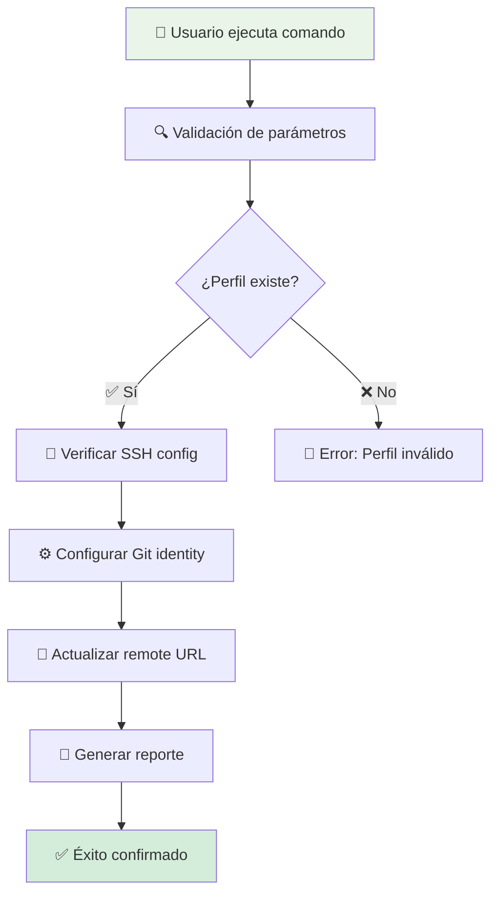
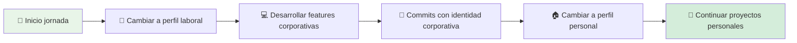
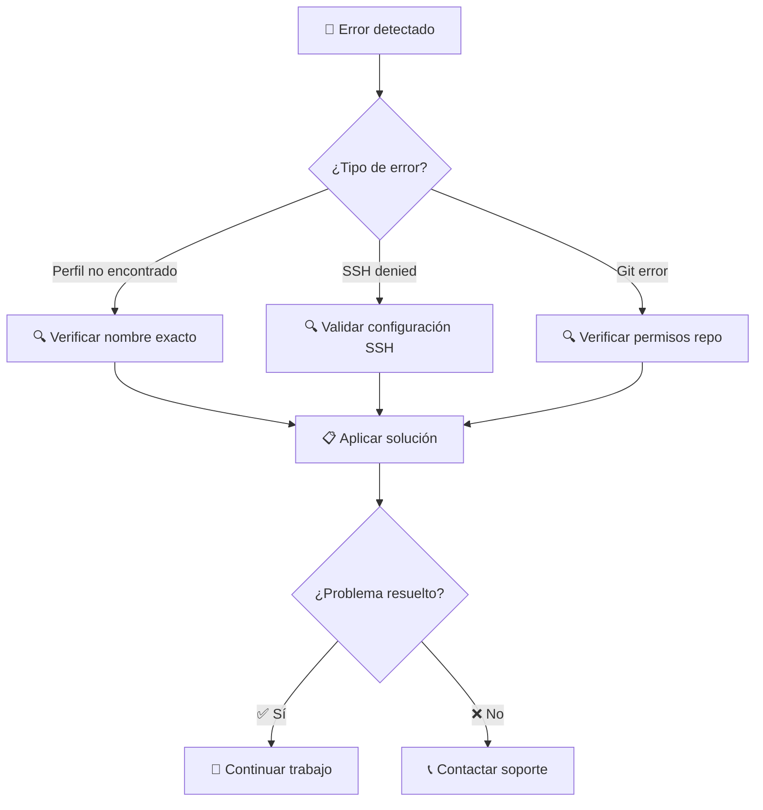

# 🔄 Guía Completa: switch_git_profile.py

[](https://python.org/)
[](https://git-scm.com/)

> **Guía definitiva** para usar el script de gestión de perfiles Git, con ejemplos prácticos, troubleshooting y mejores prácticas.

## 📋 Descripción General

El script `switch_git_profile.py` es una herramienta inteligente que permite **alternar automáticamente** entre diferentes identidades de Git, facilitando el trabajo con múltiples repositorios y organizaciones.

### ✨ Características Principales

- 👤 **Gestión de Identidades**: Cambio automático de user.name y user.email
- 🔗 **Configuración de Remotos**: Actualización automática de URLs de repositorios
- 🔐 **Validación SSH**: Verificación de configuración de claves
- 📊 **Logging Inteligente**: Reportes detallados de operaciones

## 🏗️ Arquitectura del Proceso



## 📂 Ubicación y Estructura

```
📁 Scripts/
├── 🔄 switch_git_profile.py    # 🐍 Script principal
└── 📋 README_switch_git_profile.md  # 📖 Esta documentación
```

## 🚀 Uso Interactivo

### 🛠️ Comandos Básicos

```bash
# Cambiar a perfil personal
python Scripts/switch_git_profile.py personal

# Cambiar a perfil laboral
python Scripts/switch_git_profile.py laboral

# Ver ayuda integrada
python Scripts/switch_git_profile.py --help
```

### 📊 Perfiles Disponibles

| Perfil | Identidad | Email | Propósito |
|--------|-----------|-------|-----------|
| **personal** | Portfolio-jaime | jaimehenao8126@outlook.com | Desarrollo personal/portfolio |
| **laboral** | jhenao-nex | jaime.andres.henao.arbelaez@ba.com | Trabajo corporativo |

## ⚙️ Configuración Técnica

### 📋 Prerrequisitos del Sistema

| Componente | Versión Mínima | Verificación |
|------------|----------------|--------------|
| 🐍 **Python** | 3.8+ | `python --version` |
| 📦 **Git** | 2.30+ | `git --version` |
| 🔑 **SSH Client** | OpenSSH 8.0+ | `ssh -V` |

### 🔐 Configuración SSH Requerida

#### 📝 Archivo `~/.ssh/config`

```bash
# Perfil Personal - Portfolio
Host github-portfolio
    HostName github.com
    User git
    IdentityFile ~/.ssh/id_rsa_portfolio
    IdentitiesOnly yes

# Perfil Laboral - Corporativo
Host github.com
    HostName github.com
    User git
    IdentityFile ~/.ssh/id_rsa_laboral
    IdentitiesOnly yes
```

#### 🔑 Generación de Claves SSH

```bash
# Clave para perfil personal
ssh-keygen -t rsa -b 4096 -C "jaimehenao8126@outlook.com" -f ~/.ssh/id_rsa_portfolio

# Clave para perfil laboral
ssh-keygen -t rsa -b 4096 -C "jaime.andres.henao.arbelaez@ba.com" -f ~/.ssh/id_rsa_laboral

# Agregar al agente SSH
ssh-add ~/.ssh/id_rsa_portfolio
ssh-add ~/.ssh/id_rsa_laboral
```

## 📝 Ejemplos Prácticos

### 🔄 Flujo de Trabajo Diario



#### 🛠️ Sesión de Trabajo Típica

```bash
# Verificar estado inicial
git config user.name
git config user.email

# Cambiar a perfil laboral
python Scripts/switch_git_profile.py laboral
# Output: "Perfil 'laboral' configurado correctamente."

# Verificar cambio
git config user.name  # Debe mostrar: jhenao-nex
git config user.email # Debe mostrar: jaime.andres.henao.arbelaez@ba.com

# Realizar commits
git add .
git commit -m "feat: implementar nueva funcionalidad"
git push origin main

# Cambiar de vuelta a personal
python Scripts/switch_git_profile.py personal
```

## 🆘 Troubleshooting Avanzado

### 🔍 Diagnóstico Sistemático



### 🔧 Soluciones a Problemas Comunes

| 🚨 Problema | 🔍 Síntomas | ✅ Solución |
|-------------|-------------|-------------|
| `Perfil no encontrado` | "Perfil 'xxx' no encontrado" | Verificar ortografía: `personal` o `laboral` |
| `Permission denied (publickey)` | Fallo de autenticación SSH | Revisar `~/.ssh/config` y claves públicas en GitHub |
| `No such file or directory` | Error de path | Ejecutar desde raíz del repositorio Git |
| `Remote URL incorrecta` | Push/pull falla | Verificar configuración del perfil en el script |

#### 🛠️ Comandos de Diagnóstico

```bash
# Verificar configuración Git actual
git config --list | grep user

# Verificar remotos configurados
git remote -v

# Probar conexión SSH
ssh -T git@github.com
ssh -T git@github-portfolio

# Verificar que estamos en un repo Git
ls -la .git

# Ver estado del agente SSH
ssh-add -l
```

## 🔧 Personalización Avanzada

### ➕ Agregar Nuevos Perfiles

```python
# En switch_git_profile.py, editar el diccionario profiles
profiles = {
    "personal": {
        "user": "Portfolio-jaime",
        "email": "jaimehenao8126@outlook.com",
        "remote": "git@github-portfolio:Portfolio-jaime/Backstage-Manual.git"
    },
    "laboral": {
        "user": "jhenao-nex",
        "email": "jaime.andres.henao.arbelaez@ba.com",
        "remote": "git@github.com:empresa/repo.git"
    },
    "open_source": {
        "user": "jaimehenao-oss",
        "email": "jaimehenao8126+oss@outlook.com",
        "remote": "git@github-oss:jaimehenao/my-open-source-project.git"
    }
}
```

### 🔄 Automatización con Alias

```bash
# Agregar a ~/.bashrc o ~/.zshrc
alias git-personal="python Scripts/switch_git_profile.py personal"
alias git-laboral="python Scripts/switch_git_profile.py laboral"
alias git-oss="python Scripts/switch_git_profile.py open_source"

# Uso simplificado
git-personal  # Cambia a perfil personal
git-laboral   # Cambia a perfil laboral
git-oss       # Cambia a perfil open source
```

### 📊 Integración con Hooks de Git

```bash
# .git/hooks/post-commit
#!/bin/bash
# Log automático de commits por perfil
echo "$(date): $(git config user.name) - $(git rev-parse HEAD)" >> ~/.git-commit-log
```

## 📈 Mejores Prácticas

### 🔒 Seguridad

- 🔐 **Nunca compartir** claves privadas entre perfiles
- 🔄 **Rotar claves** periódicamente
- 📝 **Backup regular** de configuración SSH
- 🛡️ **Usar passphrase** en claves privadas

### 🚀 Productividad

- 📊 **Verificar identidad** antes de commits importantes
- 🔄 **Automatizar cambios** frecuentes con alias
- 📝 **Documentar perfiles** personalizados
- 🔍 **Monitorear logs** de cambios de perfil

### 🤝 Trabajo en Equipo

- 📋 **Coordinar perfiles** con el equipo
- 🔄 **Sincronizar configuración** SSH
- 📚 **Documentar procesos** internos
- 🎯 **Definir convenciones** de commits

## 🔮 Extensiones Futuras

### 🚀 Mejoras Planificadas

- [ ] 🔧 **Interfaz gráfica**: GUI para gestión de perfiles
- [ ] 📊 **Dashboard**: Visualización de uso de perfiles
- [ ] 🔄 **Auto-detección**: Cambio automático basado en directorio
- [ ] 📱 **Notificaciones**: Alertas de cambios de perfil
- [ ] 🔐 **Integración SSO**: Autenticación enterprise

### 🛠️ Funcionalidades Avanzadas

- [ ] 📊 **Analytics**: Métricas de uso por perfil
- [ ] 🔄 **Backup automático**: Configuración de perfiles
- [ ] 🤖 **Validación automática**: Verificación de configuración
- [ ] 📈 **Performance**: Optimización de switches
- [ ] 🔍 **Auditoría**: Logs detallados de operaciones

## 📞 Soporte y Comunidad

### 🆘 Canales de Ayuda

- 📧 **Email**: jaimehenao8126@outlook.com
- 🐛 **Issues**: [GitHub Issues](https://github.com/Portfolio-jaime/Backstage-Manual/issues)
- 📖 **Python Docs**: [docs.python.org](https://docs.python.org/3/)
- 📦 **Git Docs**: [git-scm.com/doc](https://git-scm.com/doc)

### 🌟 Comunidad

- 🤝 **Contribuciones abiertas**
- 📚 **Mejora continua** de la documentación
- 💡 **Innovación** en automatización
- 🌍 **Adopción global**

---

<div align="center">

**🔄 Desarrollado con ❤️ para simplificar la gestión de identidades Git**

*¡Un perfil, un commit, una identidad!*

</div>
