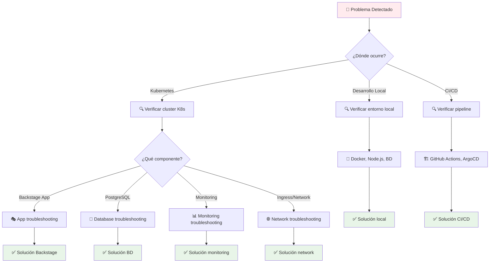
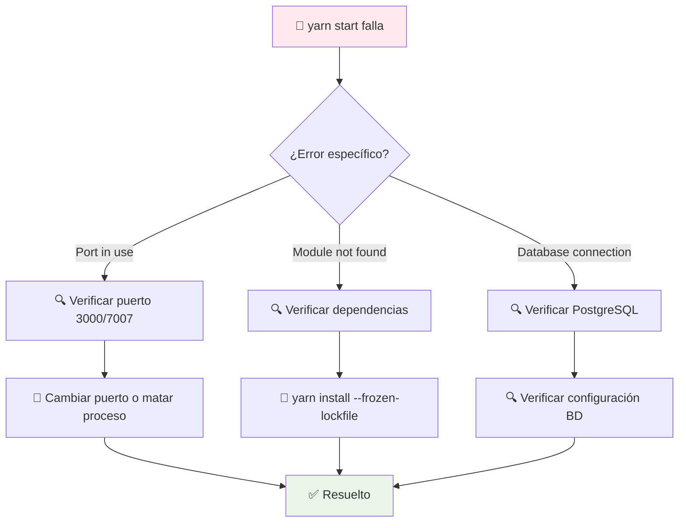
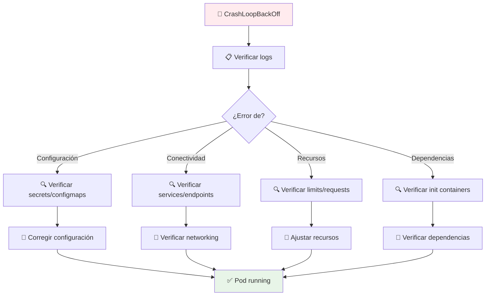
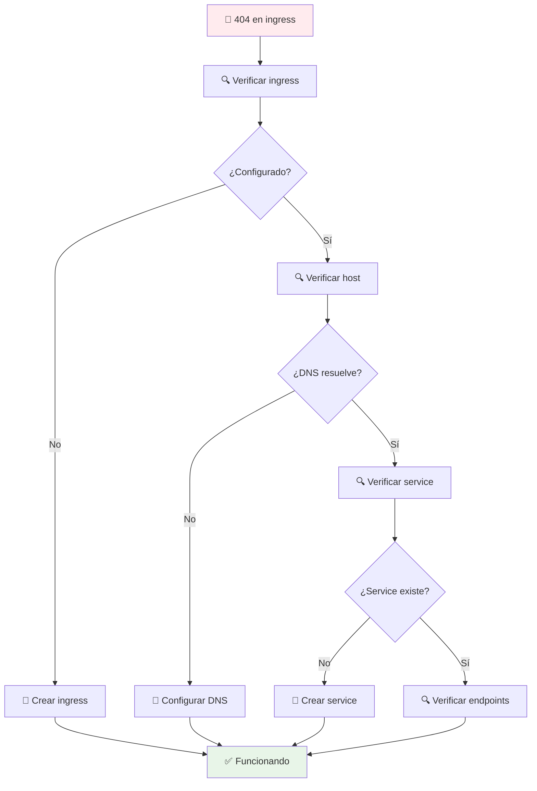
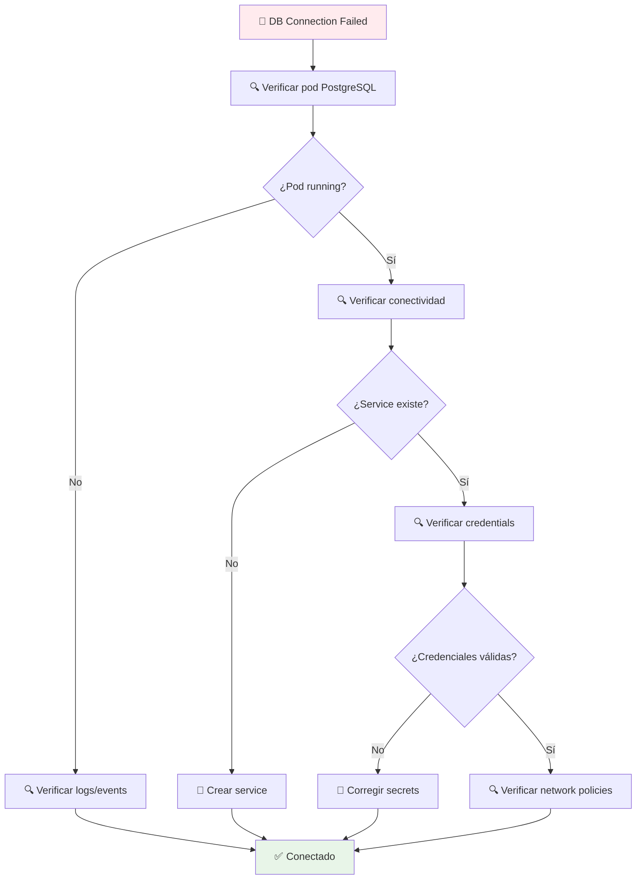
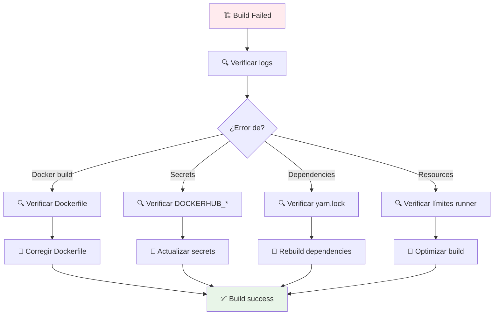
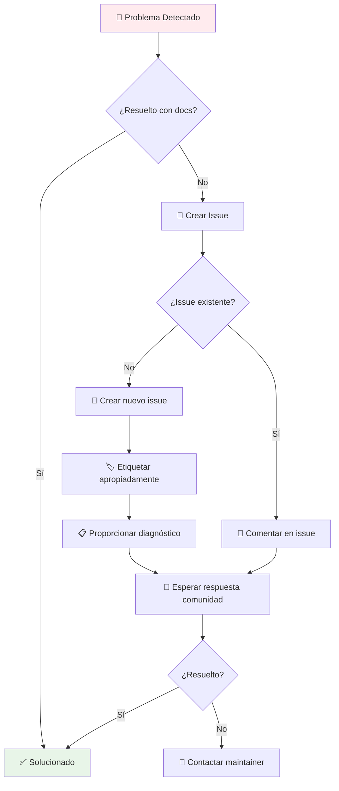

# 🆘 Guía Global de Troubleshooting - Backstage Solutions

[](#)
[](https://kubernetes.io/)
[](https://backstage.io/)

> **Guía definitiva de resolución de problemas** para el despliegue y operación de Backstage Solutions. Diagramas de decisión, comandos de diagnóstico y soluciones probadas.

## 🎯 Navegación Rápida

### 🚨 **Por Tipo de Problema**
- [**Pods en Estados Anómalos**](#pods-problems) - CrashLoopBackOff, Pending, etc.
- [**Problemas de Conectividad**](#connectivity-issues) - Services, Ingress, DNS
- [**Issues de Base de Datos**](#database-problems) - PostgreSQL, conexiones, datos
- [**Problemas de Monitoreo**](#monitoring-issues) - Prometheus, Grafana, métricas
- [**Issues de CI/CD**](#cicd-problems) - Builds, deployments, pipelines

### 🛠️ **Herramientas de Diagnóstico**
- [**Comandos Globales**](#global-diagnostic-commands) - kubectl, logs, describe
- [**Scripts de Troubleshooting**](#diagnostic-scripts) - Automatización de diagnóstico
- [**Health Checks**](#health-checks) - Verificaciones de estado

---

## 🚨 Árbol de Decisión Principal



---

## 🐳 Desarrollo Local - Problemas Comunes

### 🚫 **Aplicación no inicia**



**Soluciones rápidas:**
```bash
# Verificar puerto ocupado
lsof -i :3000
lsof -i :7007

# Matar proceso en puerto
kill -9 $(lsof -t -i:3000)

# Reinstalar dependencias
rm -rf node_modules yarn.lock
yarn install

# Verificar PostgreSQL
psql -h localhost -U backstage -d backstage -c "SELECT 1;"
```

### 🔌 **Base de datos local no conecta**

```bash
# Verificar servicio PostgreSQL
brew services list | grep postgresql

# Iniciar PostgreSQL
brew services start postgresql

# Verificar conexión
psql postgres

# Crear base de datos si no existe
createdb backstage
createuser backstage
psql -c "ALTER USER backstage CREATEDB;"
```

---

## ☸️ Kubernetes - Estados de Pods

### 🚨 **Pods en CrashLoopBackOff**



**Comandos de diagnóstico:**
```bash
# Ver logs detallados del pod
kubectl logs -f deployment/backstage -n backstage-manual --previous

# Ver eventos del pod
kubectl describe pod -l app=backstage -n backstage-manual

# Ver estado de recursos
kubectl get all -n backstage-manual

# Verificar secrets
kubectl describe secret backstage-secrets -n backstage-manual
```

### ⏳ **Pods en Pending**

```bash
# Verificar eventos del pod
kubectl describe pod <pod-name> -n backstage-manual

# Comunes causas:
# - Recursos insuficientes
kubectl get nodes --show-labels
kubectl describe node <node-name>

# - Storage no disponible
kubectl get pvc -n backstage-manual
kubectl describe pvc postgres-pvc -n backstage-manual

# - Affinity/Anti-affinity rules
kubectl get pod <pod-name> -n backstage-manual -o yaml | grep -A 10 affinity
```

### 🖼️ **ImagePullBackOff**

```bash
# Verificar imagen existe
docker pull jaimehenao8126/backstage-custom:latest

# Verificar registry credentials
kubectl get secrets -n backstage-manual
kubectl describe secret regcred -n backstage-manual

# Verificar pull policy
kubectl get deployment backstage -n backstage-manual -o yaml | grep imagePullPolicy

# Forzar pull de imagen
kubectl set image deployment/backstage backstage=jaimehenao8126/backstage-custom:latest --record
```

---

## 🌐 Problemas de Conectividad

### 🚪 **Ingress no funciona**



**Diagnóstico completo:**
```bash
# Verificar ingress
kubectl get ingress -n backstage-manual
kubectl describe ingress backstage -n backstage-manual

# Verificar service
kubectl get svc -n backstage-manual
kubectl describe svc backstage -n backstage-manual

# Verificar endpoints
kubectl get endpoints -n backstage-manual

# Probar conectividad interna
kubectl exec -it deployment/backstage -n backstage-manual -- curl http://localhost:7007

# Verificar DNS (desde pod)
kubectl run test-dns --image=busybox --rm -it -- nslookup backstage.local
```

### 🔗 **Service no conecta**

```bash
# Verificar selector del service
kubectl get svc backstage -n backstage-manual -o yaml | grep selector

# Verificar labels del pod
kubectl get pods -l app=backstage -n backstage-manual --show-labels

# Verificar endpoints
kubectl get endpoints backstage -n backstage-manual

# Probar conectividad
kubectl run test-connect --image=busybox --rm -it -- wget http://backstage:7007
```

---

## 🐘 Problemas de Base de Datos

### 🔌 **Conexión a PostgreSQL falla**



**Diagnóstico de BD:**
```bash
# Verificar estado de PostgreSQL
kubectl get pods -l app=postgres -n backstage-manual
kubectl logs -f deployment/postgres -n backstage-manual

# Probar conexión desde Backstage
kubectl exec -it deployment/backstage -n backstage-manual -- psql -h postgres -U backstage -d backstage -c "SELECT 1;"

# Verificar secrets
kubectl get secret postgres-secrets -n backstage-manual -o yaml

# Verificar PVC
kubectl get pvc postgres-pvc -n backstage-manual
kubectl describe pvc postgres-pvc -n backstage-manual
```

### 💾 **Persistencia de datos perdida**

```bash
# Verificar PVC bound
kubectl get pvc -n backstage-manual

# Verificar PV
kubectl get pv | grep postgres

# Verificar storage class
kubectl get storageclass

# Ver backup si existe
kubectl get cronjob -n backstage-manual
kubectl get jobs -n backstage-manual
```

---

## 📊 Problemas de Monitoreo

### 📈 **Métricas no aparecen**

```bash
# Verificar Prometheus
kubectl get pods -l app.kubernetes.io/name=prometheus -n monitoring
kubectl logs -f statefulset/prometheus-kube-prometheus-stack-prometheus -n monitoring

# Verificar service monitors
kubectl get servicemonitor -n backstage-manual
kubectl describe servicemonitor backstage-servicemonitor -n backstage-manual

# Verificar targets en Prometheus
kubectl port-forward svc/kube-prometheus-stack-prometheus 9090:9090 -n monitoring
# Acceder: http://localhost:9090/targets

# Verificar Grafana
kubectl get pods -l app.kubernetes.io/name=grafana -n monitoring
kubectl logs -f deployment/kube-prometheus-stack-grafana -n monitoring
```

### 🚨 **Alertas no funcionan**

```bash
# Verificar Alertmanager
kubectl get pods -l app.kubernetes.io/name=alertmanager -n monitoring
kubectl logs -f statefulset/prometheus-kube-prometheus-stack-alertmanager -n monitoring

# Verificar reglas de alerta
kubectl get prometheusrules -n monitoring
kubectl describe prometheusrule kubernetes-alerts -n monitoring

# Verificar configuración de alertas
kubectl get secret alertmanager-kube-prometheus-stack-alertmanager -n monitoring -o yaml
```

---

## 🚀 Problemas de CI/CD

### 🏗️ **Build falla en GitHub Actions**



**Diagnóstico de CI/CD:**
```bash
# Ver estado del workflow
gh run list --workflow=docker-image.yml

# Ver logs detallados
gh run view <run-id> --log

# Verificar secrets
gh secret list

# Probar build local
docker build -f IDP/Dockerfile ./IDP
```

### 🔄 **ArgoCD no sincroniza**

```bash
# Verificar estado de aplicación
kubectl get applications backstage -n argocd
kubectl describe application backstage -n argocd

# Ver logs de ArgoCD
kubectl logs -f deployment/argocd-repo-server -n argocd
kubectl logs -f deployment/argocd-application-controller -n argocd

# Forzar sync manual
kubectl get application backstage -n argocd -o yaml
argocd app sync backstage

# Verificar diferencias
argocd app diff backstage
```

---

## 🛠️ Herramientas de Diagnóstico Globales

### 📋 **Comandos de Troubleshooting**

```bash
# Información general del cluster
kubectl cluster-info
kubectl get nodes
kubectl get namespaces

# Estado de recursos por namespace
kubectl get all -n backstage-manual
kubectl get pvc,pv -n backstage-manual
kubectl get ingress -n backstage-manual

# Logs de componentes
kubectl logs -f deployment/backstage -n backstage-manual --tail=100
kubectl logs -f deployment/postgres -n backstage-manual --tail=100

# Eventos del cluster
kubectl get events -n backstage-manual --sort-by=.metadata.creationTimestamp

# Métricas de recursos
kubectl top nodes
kubectl top pods -n backstage-manual

# Configuración de red
kubectl get networkpolicies -n backstage-manual
kubectl get services -n backstage-manual -o wide
```

### 🤖 **Scripts de Diagnóstico Automatizados**

```bash
# Script de health check completo
#!/bin/bash
echo "🔍 Backstage Solutions Health Check"
echo "==================================="

# Verificar namespace
echo "📁 Namespace: $(kubectl get ns backstage-manual 2>/dev/null && echo '✅' || echo '❌')"

# Verificar pods
echo "🐳 Pods running: $(kubectl get pods -n backstage-manual --no-headers | grep Running | wc -l)/$(kubectl get pods -n backstage-manual --no-headers | wc -l)"

# Verificar services
echo "🌐 Services: $(kubectl get svc -n backstage-manual --no-headers | wc -l)"

# Verificar ingress
echo "🚪 Ingress: $(kubectl get ingress -n backstage-manual --no-headers | wc -l)"

# Verificar PVC
echo "💾 PVC bound: $(kubectl get pvc -n backstage-manual --no-headers | grep Bound | wc -l)/$(kubectl get pvc -n backstage-manual --no-headers | wc -l)"

echo "==================================="
echo "📋 Verificación completa ejecutada"
```

### 📊 **Health Checks por Componente**

#### 🎭 **Backstage Health Check**
```bash
# Verificar aplicación
kubectl exec -it deployment/backstage -n backstage-manual -- curl http://localhost:7007/healthcheck

# Verificar base de datos desde app
kubectl exec -it deployment/backstage -n backstage-manual -- psql -h postgres -U backstage -d backstage -c "SELECT COUNT(*) FROM catalog_entity;"

# Verificar métricas
kubectl exec -it deployment/backstage -n backstage-manual -- curl http://localhost:7007/metrics
```

#### 🐘 **PostgreSQL Health Check**
```bash
# Verificar conectividad
kubectl exec -it deployment/postgres -n backstage-manual -- psql -U backstage -d backstage -c "SELECT version();"

# Verificar tablas
kubectl exec -it deployment/postgres -n backstage-manual -- psql -U backstage -d backstage -c "\dt"

# Verificar conexiones activas
kubectl exec -it deployment/postgres -n backstage-manual -- psql -U backstage -d backstage -c "SELECT COUNT(*) FROM pg_stat_activity;"
```

#### 📊 **Monitoring Health Check**
```bash
# Verificar Prometheus
kubectl port-forward svc/kube-prometheus-stack-prometheus 9090:9090 -n monitoring &
curl http://localhost:9090/-/healthy

# Verificar Grafana
kubectl port-forward svc/kube-prometheus-stack-grafana 3000:80 -n monitoring &
curl http://localhost:3000/api/health

# Verificar targets
curl http://localhost:9090/api/v1/targets | jq '.data.activeTargets[] | select(.health != "up")'
```

---

## 📞 Escalación y Soporte

### 🆘 **Niveles de Escalación**



### 📧 **Canales de Soporte**

- 🐛 **GitHub Issues**: [Reportar bugs](https://github.com/Portfolio-jaime/Backstage-Manual/issues)
- 💬 **GitHub Discussions**: [Preguntas generales](https://github.com/Portfolio-jaime/Backstage-Manual/discussions)
- 📧 **Email**: jaimehenao8126@outlook.com
- 📖 **Documentación**: [DOCS_INDEX.md](DOCS_INDEX.md)

### 📋 **Información para Reportar Issues**

**Template recomendado:**
```
## 🐛 Bug Report

### Descripción
[Breve descripción del problema]

### Pasos para reproducir
1. [Paso 1]
2. [Paso 2]
3. [Paso 3]

### Comportamiento esperado
[Qué debería pasar]

### Comportamiento actual
[Qué está pasando]

### Información del entorno
- Kubernetes versión: [kubectl version]
- Backstage versión: [backstage --version]
- Sistema operativo: [uname -a]

### Logs relevantes
```
kubectl logs deployment/backstage -n backstage-manual --tail=50
```

### Comandos de diagnóstico ejecutados
[Output de comandos relevantes]
```

---

## 🎯 Checklist de Troubleshooting

### 🔍 **Antes de reportar un issue**

- [ ] **Revisé la documentación** relevante
- [ ] **Verifiqué comandos básicos** de diagnóstico
- [ ] **Busqué issues similares** en GitHub
- [ ] **Probé en entorno limpio** (si aplica)
- [ ] **Incluí información completa** del entorno
- [ ] **Proporcioné logs relevantes** (sin información sensible)

### 🛠️ **Comandos de verificación rápida**

```bash
# Health check completo
echo "🔍 Verificación rápida del sistema"
echo "=================================="
kubectl get all -n backstage-manual --no-headers | head -10
echo ""
kubectl get events -n backstage-manual --sort-by=.metadata.creationTimestamp | tail -5
echo ""
kubectl top pods -n backstage-manual 2>/dev/null || echo "Metrics no disponibles"
```

---

<div align="center">

**🆘 Troubleshooting que salva el día**

*¡La resolución de problemas es una habilidad, no un don!*

[](https://github.com/Portfolio-jaime)
[](https://kubernetes.io/)

</div>